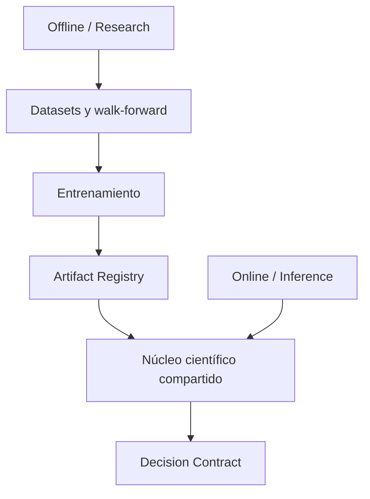
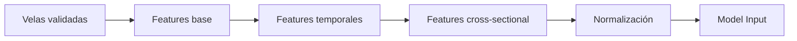
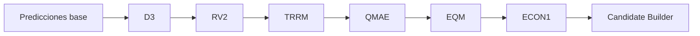
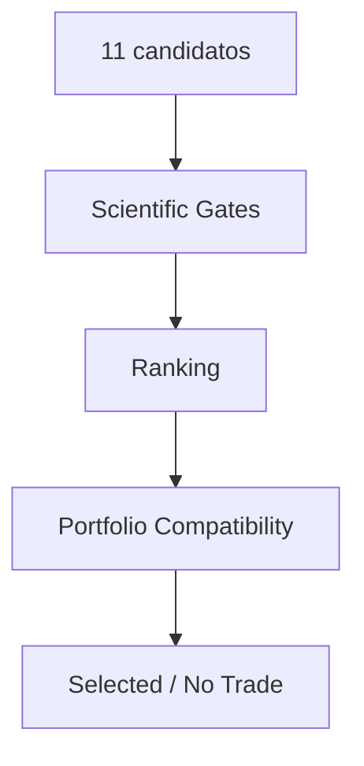
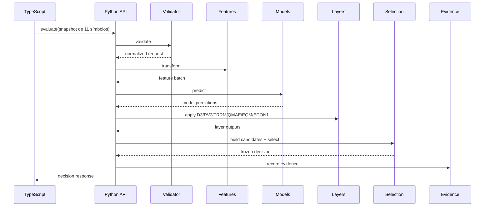
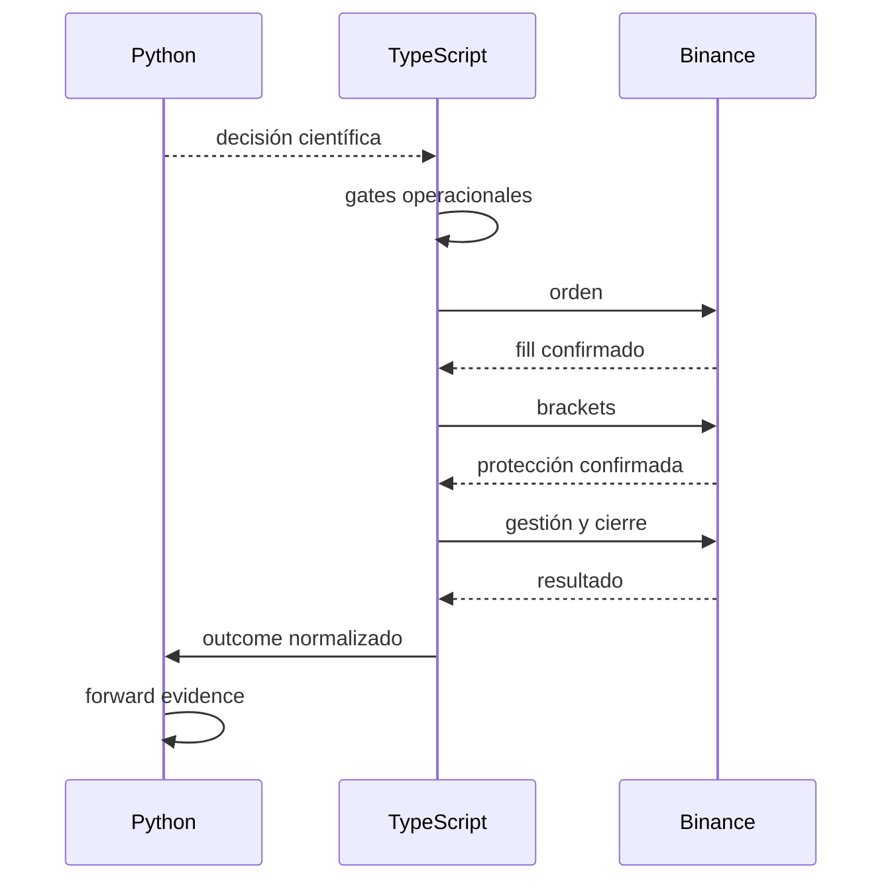

# Aegis Clean Rebuild
## Arquitectura del cerebro científico en Python y contrato con el bot operacional en TypeScript

**Estado del documento:** diseño objetivo previo a implementación  
**Propósito:** servir como mapa arquitectónico para Codex, Fable u otro agente de ingeniería  
**Principio central:** Python produce decisiones científicas; TypeScript controla toda interacción operacional y toda ejecución en Binance.

---

## 1. Objetivo

Reconstruir Aegis desde una base limpia con dos responsabilidades estrictamente separadas:

```text
Python
  = datos científicos
  + features
  + modelos
  + regímenes
  + calidad
  + selección
  + señales
  + evidencia científica

TypeScript
  = mercado
  + Binance
  + riesgo operacional
  + órdenes
  + fills
  + brackets
  + posiciones
  + recuperación
  + observabilidad operacional
```

La comunicación entre ambos sistemas debe ocurrir mediante un contrato pequeño, versionado, determinista y verificable.

Python no debe conocer detalles propios de Binance, como `tickSize`, `stepSize`, `orderId`, `positionSide`, `reduceOnly`, `closePosition`, leverage aplicado, margen disponible, fill real o precio final de entrada.

TypeScript no debe reconstruir features, ejecutar modelos, recalcular scores científicos ni reinterpretar internamente las capas D3, RV2, TRRM, QMAE, EQM, ECON1 o Selection Policy.

---

## 2. Principios no negociables

### 2.1 Un solo cerebro científico

Todas las decisiones científicas deben atravesar un único pipeline en Python. No deben existir caminos alternos que calculen señales de forma distinta.

### 2.2 Un solo ejecutor

Toda interacción con Binance debe permanecer en TypeScript. Python no debe tener adaptadores del exchange, clientes REST, WebSockets operacionales ni lógica de órdenes.

### 2.3 `NO_TRADE` es una decisión válida

La ausencia de una operación no representa un error. El cerebro puede evaluar los once símbolos y decidir que ninguno cumple las condiciones científicas.

### 2.4 Determinismo

La misma entrada, con la misma configuración, el mismo conjunto de artefactos y las mismas restricciones, debe producir el mismo resultado.

### 2.5 Fail closed

Una inconsistencia de configuración, un modelo ausente, una vela incompleta, un hash diferente, un timestamp inválido o una respuesta expirada deben terminar sin una nueva entrada.

### 2.6 Configuración sin duplicaciones

Los parámetros científicos pertenecen a Python. Los parámetros de ejecución pertenecen a TypeScript. Solo los datos necesarios para validar el contrato pueden aparecer en ambos lados.

### 2.7 Cada archivo debe participar en el flujo

No se crearán archivos por cada clase pequeña. Se agruparán conceptos relacionados, manteniendo utilidades técnicas separadas de la lógica de negocio.

### 2.8 Evidencia completa

Cada decisión debe poder reconstruirse posteriormente sin depender de logs informales.

---

## 3. Vista general


### Flujo resumido

1. TypeScript recibe y valida datos de mercado.
2. Cuando existe un corte temporal válido, crea un snapshot coordinado del universo de once símbolos.
3. TypeScript llama al servicio Python con datos cerrados y contexto operacional limitado.
4. Python valida, genera features, ejecuta modelos y capas, crea candidatos y selecciona.
5. Python devuelve una decisión científica, no una orden.
6. TypeScript verifica autorización, riesgo, posiciones, configuración, salud y vigencia.
7. TypeScript calcula cantidad y precios operacionales a partir del fill real.
8. TypeScript ejecuta y administra la posición.
9. Al cierre, TypeScript entrega a Python evidencia forward normalizada.

---

## 4. Universo de once símbolos

El sistema trabaja sobre un universo fijo de **exactamente once símbolos**.

La lista concreta no se inventa en este documento. Debe obtenerse del `regimen.config.yaml` existente en la rama limpia del bot TypeScript y quedar registrada en el manifiesto compartido.

### Regla de fuente de verdad

- El bot TypeScript conserva el universo operacional autorizado.
- Python carga el mismo universo desde su configuración científica.
- Ambos lados calculan un `symbol_set_hash`.
- Ninguna evaluación puede continuar si los hashes difieren.
- El orden canónico de los símbolos debe estar definido y ser estable.
- El orden de llegada de objetos JSON no debe modificar el resultado.

### Plantilla del universo

| Índice canónico | Símbolo |
|---:|---|
| 1 | Resolver desde `regimen.config.yaml` |
| 2 | Resolver desde `regimen.config.yaml` |
| 3 | Resolver desde `regimen.config.yaml` |
| 4 | Resolver desde `regimen.config.yaml` |
| 5 | Resolver desde `regimen.config.yaml` |
| 6 | Resolver desde `regimen.config.yaml` |
| 7 | Resolver desde `regimen.config.yaml` |
| 8 | Resolver desde `regimen.config.yaml` |
| 9 | Resolver desde `regimen.config.yaml` |
| 10 | Resolver desde `regimen.config.yaml` |
| 11 | Resolver desde `regimen.config.yaml` |

Si Codex no puede demostrar cuál es la lista real, debe detenerse y reportarlo. No debe rellenar símbolos por intuición.

### Evaluación transversal

Los símbolos no deben tratarse como once bots independientes. El cerebro debe observar:

- contexto individual;
- contexto del universo;
- correlación o concentración;
- régimen dominante;
- dispersión de scores;
- disponibilidad de candidatos;
- conflictos entre oportunidades;
- calidad relativa de cada candidato.

El resultado es una selección conjunta, no once decisiones aisladas sin coordinación.

---

## 5. Dos modos del sistema Python

Python debe tener dos modos conceptuales separados, aunque compartan el mismo núcleo matemático.



### 5.1 Offline / Research

Responsable de:

- construir datasets;
- validación temporal;
- walk-forward;
- entrenamiento;
- evaluación;
- calibración;
- comparación de modelos;
- selección de artefactos;
- publicación de bundles inmutables.

No debe ejecutar órdenes ni depender de Binance en vivo.

### 5.2 Online / Inference

Responsable de:

- cargar un bundle previamente aprobado;
- validar solicitudes;
- generar features con la misma definición usada en entrenamiento;
- ejecutar inferencia;
- aplicar las capas científicas;
- emitir una decisión;
- producir evidencia.

No debe entrenar en el camino crítico.

---

## 6. Entradas de Python

Python debe recibir datos preparados por TypeScript. No debe consultar Binance para completar información faltante.

### 6.1 Snapshot de mercado

La solicitud debe representar un corte temporal completo:

- `request_id`;
- `decision_cycle_id`;
- `closed_at`;
- `timeframe`;
- `schema_version`;
- `config_version`;
- `symbol_set_hash`;
- historial de velas por símbolo;
- indicadores de calidad del feed;
- último timestamp confirmado por símbolo;
- marca de vela cerrada;
- contexto operacional permitido.

### 6.2 Datos por vela

El contrato mínimo debe contemplar:

- timestamp de apertura;
- timestamp de cierre;
- open;
- high;
- low;
- close;
- volume;
- indicador de cierre confirmado;
- fuente;
- secuencia o versión cuando aplique.

Cualquier campo adicional debe existir porque participa en el pipeline real.

### 6.3 Contexto operacional permitido

TypeScript puede informar a Python:

- símbolos temporalmente bloqueados;
- posiciones actualmente ocupadas;
- número de slots disponibles;
- exposición por dirección;
- cooldowns activos;
- identificadores de decisiones previamente aceptadas;
- hora operacional actual.

Python usa este contexto únicamente para selección científica y compatibilidad de cartera. No debe usarlo para calcular órdenes.

### 6.4 Datos que Python no debe recibir

Evitar enviar, salvo necesidad de auditoría explícita:

- claves;
- secretos;
- objetos internos del SDK;
- order IDs como insumo científico;
- saldo exacto como base para sizing;
- tick size;
- step size;
- leverage aplicado;
- detalles de retry de Binance;
- respuestas crudas del exchange.

---

## 7. Validación y normalización

Antes de calcular una sola feature, Python debe validar la solicitud.

### Validaciones obligatorias

1. El contrato es compatible.
2. Existen exactamente once símbolos.
3. El `symbol_set_hash` coincide.
4. Todos los símbolos pertenecen al universo aprobado.
5. No hay símbolos duplicados.
6. El timeframe coincide con el bundle.
7. Las velas están ordenadas.
8. No existen timestamps futuros.
9. El último periodo está cerrado.
10. La profundidad histórica es suficiente.
11. No existen huecos no permitidos.
12. Los valores son finitos.
13. OHLC conserva coherencia.
14. El volumen cumple las reglas esperadas.
15. El request no está expirado.
16. El bundle científico está cargado.
17. Las versiones de features y modelos son compatibles.

### Resultado de validación

La validación produce uno de estos estados:

- `VALID`;
- `NO_TRADE_DATA_INSUFFICIENT`;
- `NO_TRADE_DATA_STALE`;
- `NO_TRADE_UNIVERSE_MISMATCH`;
- `ERROR_CONTRACT`;
- `ERROR_MODEL_BUNDLE`.

Los errores técnicos y los rechazos científicos no deben confundirse.

---

## 8. Pipeline de features

El pipeline debe ser único para entrenamiento e inferencia.



### 8.1 Features base

Ejemplos conceptuales:

- retornos;
- rangos;
- volatilidad;
- momentum;
- volumen;
- relación cuerpo/mechas;
- posición del cierre;
- cambios relativos.

No se deben hardcodear indicadores en varios módulos.

### 8.2 Features temporales

Deben capturar:

- secuencia;
- persistencia;
- aceleración;
- cambios de volatilidad;
- comportamiento por horizonte;
- transiciones de estado.

### 8.3 Features transversales

Deben comparar los once símbolos:

- ranking relativo;
- fuerza relativa;
- dispersión;
- concentración;
- liderazgo;
- dirección dominante;
- divergencias;
- amplitud del mercado.

### 8.4 Normalización

La transformación debe estar definida por el bundle:

- parámetros congelados;
- versión;
- orden de columnas;
- manejo de valores faltantes;
- límites;
- precisión.

### 8.5 Esquema de features

El sistema debe producir:

- `feature_schema_version`;
- `feature_names`;
- `feature_count`;
- `feature_hash`;
- estadísticas de calidad;
- tensor por símbolo;
- contexto transversal.

El orden de columnas debe ser inmutable para un bundle.

---

## 9. Modelos

La arquitectura debe aceptar múltiples familias sin mezclar su implementación con la selección operacional.

### 9.1 Modelos base

La rama anterior puede contener componentes útiles, como LSTM o extractores Transformer. Codex puede estudiarlos, pero no debe copiar la estructura completa ni arrastrar archivos transitorios.

Cada modelo debe exponer un resultado normalizado, por ejemplo:

- probabilidades de clase;
- retorno esperado;
- dirección;
- incertidumbre;
- horizonte;
- embeddings opcionales;
- métricas de validez.

### 9.2 Registro de modelos

El `ModelRegistry` debe:

- cargar únicamente bundles aprobados;
- validar checksums;
- validar compatibilidad;
- exponer IDs;
- impedir hot-swaps ambiguos;
- registrar la versión utilizada en cada decisión.

### 9.3 Bundle científico

Un bundle puede contener:

- pesos;
- normalizadores;
- esquema de features;
- calibradores;
- thresholds científicos;
- metadatos de entrenamiento;
- métricas walk-forward;
- universo;
- timeframe;
- horizontes;
- hashes.

El bundle debe ser inmutable durante una evaluación.

### 9.4 Ensamble

Si existen varios modelos:

- cada modelo emite una predicción estandarizada;
- las capas posteriores determinan calidad y compatibilidad;
- el ensamble no debe ocultar predicciones individuales;
- la evidencia debe conservar aportaciones relevantes.

---

## 10. Capas científicas

Los nombres existentes deben conservarse cuando sus fórmulas sean válidas: **D3, RV2, TRRM, QMAE, EQM y ECON1**.

Este documento define su posición en el flujo. Codex debe consultar la rama anterior para recuperar su significado matemático real, evitando reinterpretar fórmulas sin evidencia.



### 10.1 D3

Responsabilidad arquitectónica propuesta:

- identificar contexto o régimen;
- producir estado, distribución o confianza de régimen;
- detectar incompatibilidad entre predicción y contexto.

Debe consumir datos científicos, no estado de Binance.

### 10.2 RV2

Responsabilidad arquitectónica propuesta:

- enriquecer la lectura de riesgo, volatilidad o validez;
- limitar confianza cuando el entorno es inestable;
- producir factores normalizados para las capas siguientes.

La fórmula real debe verificarse en la rama previa.

### 10.3 TRRM

Responsabilidad arquitectónica propuesta:

- aplicar un modificador temporal o de régimen;
- combinar persistencia, transición y riesgo;
- impedir que una señal base se interprete fuera de su contexto.

### 10.4 QMAE

Responsabilidad arquitectónica propuesta:

- evaluar calidad y error esperado;
- calibrar confianza;
- penalizar incertidumbre;
- rechazar outputs fuera de distribución.

### 10.5 EQM

Responsabilidad arquitectónica propuesta:

- arbitrar entre modelos;
- combinar calidad;
- detectar desacuerdo;
- producir un score comparable entre símbolos.

### 10.6 ECON1

Responsabilidad arquitectónica propuesta:

- determinar viabilidad económica científica;
- considerar costes estimados y margen esperado de forma abstracta;
- impedir señales cuyo edge no compense fricción esperada.

ECON1 no calcula órdenes finales ni precios de Binance. Puede emitir métricas adimensionales o porcentuales que TypeScript interpreta bajo su configuración operacional.

### 10.7 Reglas de implementación

- Cada capa tiene una entrada y salida explícitas.
- Ninguna capa consulta archivos globales de forma oculta.
- Ninguna capa escribe estado operacional.
- Las capas no deben llamarse circularmente.
- Cada transformación se registra en evidencia.
- No se deben crear seis microservicios ni decenas de archivos para seis capas.
- Las funciones puras relacionadas pueden convivir en un módulo cohesivo.

---

## 11. Candidate Builder

Después de las capas se construye un candidato por símbolo.

### Candidate científico

Debe contener conceptos como:

- símbolo;
- dirección propuesta;
- score bruto;
- score calibrado;
- confianza;
- incertidumbre;
- régimen;
- compatibilidad;
- retorno esperado;
- horizonte científico;
- intención de riesgo;
- razones positivas;
- razones de rechazo;
- IDs y versiones.

### Intención de riesgo

Python puede proponer valores abstractos:

- distancia científica de stop en porcentaje;
- múltiplo de volatilidad;
- relación objetivo/riesgo;
- número máximo de barras;
- invalidación científica;
- prioridad relativa.

Python no debe producir:

- precio final de stop;
- precio final de take profit;
- cantidad;
- notional;
- leverage aplicado;
- precisión decimal;
- tipo de orden Binance.

TypeScript convierte la intención científica a parámetros operacionales después de obtener el fill real.

---

## 12. Selection Policy

La Selection Policy recibe los once candidatos y decide cuáles son elegibles.



### 12.1 Gates científicos

Ejemplos:

- score mínimo;
- confianza mínima;
- incertidumbre máxima;
- régimen compatible;
- calidad suficiente;
- viabilidad económica;
- datos sanos;
- candidato no bloqueado;
- consistencia entre capas.

### 12.2 Ranking

El ranking debe ser global y estable:

- compara los once símbolos;
- resuelve empates de forma determinista;
- conserva score y razones;
- no depende del orden accidental del JSON.

### 12.3 Compatibilidad de cartera

La Selection Policy puede considerar:

- slots informados por TypeScript;
- símbolos ya ocupados;
- concentración;
- correlación;
- dirección;
- cooldowns;
- duplicidad de exposición.

No debe sobrepasar las restricciones operacionales. TypeScript conserva el veto final.

### 12.4 Resultado

El resultado debe ser:

- `NO_TRADE`; o
- una lista ordenada de decisiones elegibles.

Aunque normalmente TypeScript acepte una sola entrada, el contrato puede devolver ranking para auditoría. Debe quedar explícito cuál candidato fue seleccionado y cuáles fueron rechazados.

---

## 13. Threshold y Freeze

### 13.1 Threshold

El threshold científico pertenece al bundle o a la configuración Python. No debe duplicarse como número independiente en TypeScript.

TypeScript solo puede declarar expectativas, como:

- versión;
- bundle esperado;
- política requerida;
- vigencia máxima.

### 13.2 Decision Freeze

Una decisión aceptada por el cerebro debe congelarse:

- genera `decision_id`;
- registra inputs;
- registra bundle;
- registra scores;
- registra selección;
- registra expiración;
- calcula hash.

Después del freeze, ninguna capa modifica la decisión.

### 13.3 Idempotencia

Una clave lógica puede construirse a partir de:

- cierre de vela;
- timeframe;
- universo;
- bundle;
- config;
- request id.

Repetir una solicitud idéntica debe devolver el mismo resultado o una referencia al resultado congelado.

---

## 14. Respuesta hacia TypeScript

La respuesta es una decisión científica, no una instrucción directa de Binance.

### 14.1 Sobre de respuesta

Campos conceptuales:

- `contract_version`;
- `decision_id`;
- `decision_cycle_id`;
- `generated_at`;
- `expires_at`;
- `status`;
- `universe_id`;
- `symbol_set_hash`;
- `config_version`;
- `model_bundle_id`;
- `feature_schema_version`;
- `evidence_hash`;
- `selected`;
- `ranking_summary`;
- `warnings`.

### 14.2 Decisión seleccionada

Campos conceptuales:

- `symbol`;
- `side`: `LONG`, `SHORT` o `NO_TRADE`;
- `scientific_score`;
- `confidence`;
- `uncertainty`;
- `regime`;
- `expected_return`;
- `horizon`;
- `risk_intent`;
- `reason_codes`;
- `candidate_hash`.

### 14.3 Campos prohibidos

La respuesta no debe incluir como autoridad operacional:

- Binance `orderId`;
- cantidad definitiva;
- precio definitivo;
- stop final;
- take profit final;
- leverage aplicado;
- margin type ejecutado;
- `tickSize`;
- `stepSize`;
- `reduceOnly`;
- instrucciones de retry.

### 14.4 Rechazo

Un rechazo debe ser estructurado:

- `NO_TRADE_NO_CANDIDATE`;
- `NO_TRADE_THRESHOLD`;
- `NO_TRADE_REGIME`;
- `NO_TRADE_UNCERTAINTY`;
- `NO_TRADE_PORTFOLIO_CONFLICT`;
- `NO_TRADE_DATA_QUALITY`;
- `NO_TRADE_STALE`;
- `NO_TRADE_CONFIG_MISMATCH`.

---

## 15. Responsabilidad de TypeScript después de recibir la decisión

TypeScript debe tratar la respuesta como una propuesta científica.

```mermaid
flowchart LR
    DEC[Decision Response] --> VER[Contract Verification]
    VER --> AUTH[Authorization / Kill]
    AUTH --> RISK[Operational Risk]
    RISK --> POS[Position / Ownership]
    POS --> ORD[Submit Order]
    ORD --> FILL[Confirm Fill]
    FILL --> BR[Build and Confirm Brackets]
    BR --> MAN[Manage Position]
```



### Gates obligatorios en TypeScript

- respuesta válida;
- firma o hash válido;
- no expirada;
- bundle esperado;
- universo coincidente;
- símbolo permitido;
- dirección permitida;
- kill switches libres;
- autorización explícita;
- ownership consistente;
- capacidad disponible;
- riesgo diario;
- tamaño máximo;
- posición no duplicada;
- exchange ready;
- filtros disponibles.

TypeScript puede rechazar cualquier decisión. Ese rechazo debe quedar registrado y, cuando corresponda, enviarse como outcome científico no ejecutado.

---

## 16. Adaptación de `regimen.config.yaml`

`regimen.config.yaml` debe convertirse en la fuente operacional de TypeScript y en el punto de compatibilidad con el cerebro.

No debe duplicar internamente todos los parámetros científicos.

### 16.1 Secciones conceptuales

```yaml
regimen:
  id: "..."
  version: "..."

universe:
  symbols:
    - "EXACT_SYMBOL_01"
    - "EXACT_SYMBOL_02"
    # exactamente 11
  symbolSetHash: "..."
  timeframe: "..."

brain:
  endpoint: "..."
  contractVersion: "..."
  expectedUniverseId: "..."
  expectedModelBundleId: "..."
  maxDecisionAgeMs: 0
  requestTimeoutMs: 0
  failClosed: true

execution:
  enabledByConfig: false
  requireExplicitAuthorization: true
  maxConcurrentPositions: 0
  allowedSides: []
  leveragePolicy: "..."
  sizingPolicy: "..."

risk:
  maxNotional: 0
  maxDailyLoss: 0
  cooldowns: {}
  stopBounds: {}
  takeProfitBounds: {}

recovery:
  retries: {}
  timeouts: {}
  reconciliation: {}

observability:
  telegram: {}
  logs: {}
  evidence: {}
```

Los valores son placeholders de diseño, no valores recomendados.

### 16.2 Handshake

Al arrancar, TypeScript debe consultar `/manifest` en Python y comparar:

- contrato;
- universo;
- hash de símbolos;
- timeframe;
- bundle;
- esquema de features;
- configuración científica;
- estado del servicio.

Si existe incompatibilidad:

- TypeScript puede mantener administración de posiciones existentes;
- no puede crear nuevas entradas;
- debe alertar;
- debe permanecer fail closed.

### 16.3 Distribución de responsabilidades

| Configuración | Dueño |
|---|---|
| Universo autorizado | TS, sincronizado con Python |
| Timeframe operacional | TS, compatible con bundle |
| Features | Python |
| Modelos | Python |
| Threshold científico | Python |
| Selection Policy | Python |
| Leverage | TS |
| Sizing | TS |
| Límites de pérdida | TS |
| Concurrencia | TS |
| Tick/step | TS desde Binance |
| Brackets finales | TS |
| Vigencia máxima de decisión | TS |
| Endpoint y timeout | TS |
| Bundle esperado | TS como expectativa; Python como proveedor |

---

## 17. API mínima de Python

Mantener una API pequeña.

### `GET /health`

Informa si el proceso está vivo y si el runtime básico puede responder.

### `GET /ready`

Informa si:

- configuración válida;
- bundle cargado;
- features disponibles;
- universo válido;
- servicio listo para inferencia.

### `GET /manifest`

Devuelve:

- contrato;
- universo;
- hashes;
- bundle;
- esquema de features;
- capacidades;
- build.

### `POST /v1/decisions/evaluate`

Recibe un snapshot y devuelve una decisión congelada.

### `POST /v1/evidence/outcome`

Recibe evidencia normalizada del resultado operacional:

- aceptada o rechazada;
- ejecutada o no;
- fill;
- cierre;
- PnL;
- razón;
- incidentes.

Este endpoint no debe permitir que Python modifique órdenes.

### Endpoints que no deben existir

- `/order`;
- `/close`;
- `/positions`;
- `/binance`;
- `/brackets`;
- `/leverage`;
- `/emergency-close`.

---

## 18. Evidencia

### 18.1 Evidencia científica

Python registra:

- request;
- calidad de datos;
- features hash;
- outputs de modelos;
- outputs de capas;
- candidatos;
- ranking;
- threshold;
- freeze;
- decisión;
- hash final.

### 18.2 Evidencia operacional

TypeScript registra:

- recepción;
- validación;
- autorización;
- rechazo o aceptación;
- orden;
- fill;
- brackets;
- gestión;
- cierre;
- reconciliación;
- PnL;
- incidentes.

### 18.3 Unión

Ambos lados comparten:

- `decision_id`;
- `decision_cycle_id`;
- `candidate_hash`;
- `clientOrderId` derivado;
- timestamps.

Esto permite reconstruir el ciclo completo sin mezclar responsabilidades.

---

## 19. Errores y estados

### Categorías

- `SCIENTIFIC_NO_TRADE`;
- `INPUT_INVALID`;
- `CONFIG_MISMATCH`;
- `MODEL_UNAVAILABLE`;
- `INFERENCE_FAILURE`;
- `CONTRACT_FAILURE`;
- `OPERATIONAL_REJECTED`;
- `EXECUTION_INCIDENT`.

Python produce las primeras cinco. TypeScript produce las dos últimas.

### Regla

Un error de Python nunca debe provocar que TypeScript use la última señal en caché para abrir una entrada nueva.

---

## 20. Observabilidad científica

Métricas recomendadas:

- latencia total;
- latencia por etapa;
- requests válidos;
- requests rechazados;
- no-trades;
- señales por símbolo;
- distribución de scores;
- distribución de regímenes;
- incertidumbre;
- discrepancias de configuración;
- bundle activo;
- uso de caché;
- outcomes recibidos.

No registrar secretos ni datasets completos en logs generales.

---

## 21. Arquitectura de carpetas propuesta

El objetivo es un núcleo pequeño y mantenible.

```text
trading_system/
├── docs/
│   └── architecture/
│       └── AEGIS_CLEAN_REBUILD_ARCHITECTURE.md
├── config/
│   ├── brain.yaml
│   ├── universe.yaml
│   └── models.yaml
├── src/
│   └── aegis/
│       ├── __init__.py
│       ├── domain.py
│       ├── config.py
│       ├── features.py
│       ├── models.py
│       ├── layers.py
│       ├── decision.py
│       ├── evidence.py
│       ├── runtime.py
│       ├── api.py
│       ├── training/
│       │   ├── __init__.py
│       │   ├── dataset.py
│       │   ├── train.py
│       │   ├── evaluate.py
│       │   └── registry.py
│       └── utils/
│           ├── __init__.py
│           ├── hashing.py
│           └── time.py
└── tests/
    ├── unit/
    ├── contract/
    ├── integration/
    └── fixtures/
```

### Justificación

- `domain.py`: tipos, enums y contratos internos.
- `config.py`: carga y validación.
- `features.py`: pipeline único.
- `models.py`: interfaces de inferencia y ensamble.
- `layers.py`: D3, RV2, TRRM, QMAE, EQM y ECON1.
- `decision.py`: candidatos, ranking, selection y freeze.
- `evidence.py`: eventos científicos.
- `runtime.py`: orquestación del pipeline.
- `api.py`: transporte HTTP.
- `training/`: flujo offline, separado del runtime.
- `utils/`: solo utilidades técnicas sin reglas de negocio.

No crear un archivo por dataclass, por excepción o por función.

---

## 22. Estructura mínima en TypeScript

En el bot TypeScript solo se agregan las piezas necesarias para consumir el cerebro.

```text
binance-futures-bot-ts/
├── config/
│   └── regimen.config.yaml
└── src/
    └── brain/
        ├── contract.ts
        ├── client.ts
        ├── manifest.ts
        └── decision-gate.ts
```

### Responsabilidades

- `contract.ts`: tipos y versiones.
- `client.ts`: transporte y timeouts.
- `manifest.ts`: handshake.
- `decision-gate.ts`: validaciones previas a ejecución.

No crear un segundo trading engine dentro de `src/brain`.

---

## 23. Firmas conceptuales

Estas son firmas de diseño; no constituyen implementación.

### Python

```python
class DecisionEngine:
    def evaluate(self, request: DecisionRequest) -> DecisionResponse:
        """TODO: ejecutar el pipeline científico completo."""

class FeaturePipeline:
    def transform(self, snapshot: MarketSnapshot) -> FeatureBatch:
        """TODO: producir features deterministas y versionadas."""

class ModelRuntime:
    def predict(self, features: FeatureBatch) -> ModelPredictions:
        """TODO: ejecutar el bundle aprobado."""

class ScientificLayers:
    def apply(self, predictions: ModelPredictions, context: ScientificContext) -> LayerOutputs:
        """TODO: ejecutar D3, RV2, TRRM, QMAE, EQM y ECON1."""

class SelectionPolicy:
    def select(self, candidates: CandidateSet, context: PortfolioContext) -> FrozenDecision:
        """TODO: filtrar, rankear y congelar."""

class EvidenceRecorder:
    def record(self, event: ScientificEvidenceEvent) -> None:
        """TODO: persistir evidencia científica append-only."""
```

### TypeScript

```typescript
export interface BrainClient {
  getManifest(): Promise<BrainManifest>;
  evaluate(request: DecisionRequest): Promise<DecisionResponse>;
  submitOutcome(outcome: DecisionOutcome): Promise<void>;
}

export interface DecisionGate {
  validate(decision: DecisionResponse, context: OperationalContext): GateResult;
}
```

No se deben agregar métodos de órdenes en estas interfaces.

---

## 24. Orden interno de evaluación



---

## 25. Ciclo de outcome



Python no utiliza el outcome para reescribir retrospectivamente la decisión congelada. Lo usa para evaluación forward, métricas y futuros procesos offline controlados.

---

## 26. Testing esperado

### Python

- contratos;
- validación de once símbolos;
- determinismo;
- orden canónico;
- gaps;
- feature parity;
- carga de bundle;
- capas;
- ranking;
- no-trade;
- freeze;
- hashes;
- API;
- outcome evidence.

### TypeScript

- manifest mismatch;
- timeout;
- respuesta expirada;
- símbolo no permitido;
- hash distinto;
- decisión duplicada;
- no-trade;
- gate operacional;
- rechazo;
- fail closed.

### Contrato cruzado

Se debe compartir un conjunto de fixtures versionados para demostrar que ambos lados interpretan el mismo payload.

---

## 27. Uso de la rama anterior

Codex puede estudiar la rama anterior para rescatar:

- fórmulas correctas;
- modelos;
- features;
- tests;
- datasets;
- convenciones;
- ideas de D3, RV2, TRRM, QMAE, EQM y ECON1.

No debe:

- hacer merge completo;
- copiar carpetas enteras;
- restaurar adaptadores Binance en Python;
- reintroducir ejecución;
- conservar archivos solo por compatibilidad;
- replicar una clase por archivo;
- arrastrar código sin referencias.

Cada elemento recuperado debe justificar su lugar en el pipeline nuevo.

---

## 28. Criterios de aceptación del diseño

La arquitectura queda correctamente representada cuando:

1. Python no tiene dependencias de ejecución.
2. TypeScript no recalcula ciencia.
3. Existe un contrato versionado.
4. Los once símbolos están sincronizados.
5. Existe un handshake.
6. El pipeline es determinista.
7. Las capas tienen orden explícito.
8. Selection Policy es global.
9. Freeze es inmutable.
10. `NO_TRADE` es first-class.
11. TypeScript conserva veto final.
12. Los stops y targets finales se calculan después del fill.
13. La evidencia une ambos sistemas.
14. Configuración científica y operacional no se duplican.
15. La estructura no está fragmentada innecesariamente.

---

## 29. Qué no se implementará durante el primer scaffold

La primera iteración solo crea:

- carpetas;
- archivos mínimos;
- tipos;
- protocolos;
- firmas;
- docstrings;
- comentarios `TODO`;
- contratos;
- configuración placeholder validable;
- referencias entre módulos.

No se implementará:

- features;
- modelos;
- fórmulas;
- entrenamiento;
- inferencia real;
- HTTP funcional;
- persistencia;
- Binance;
- ejecución;
- migración de código anterior;
- despliegue.

Al terminar el scaffold, el agente debe detenerse.
