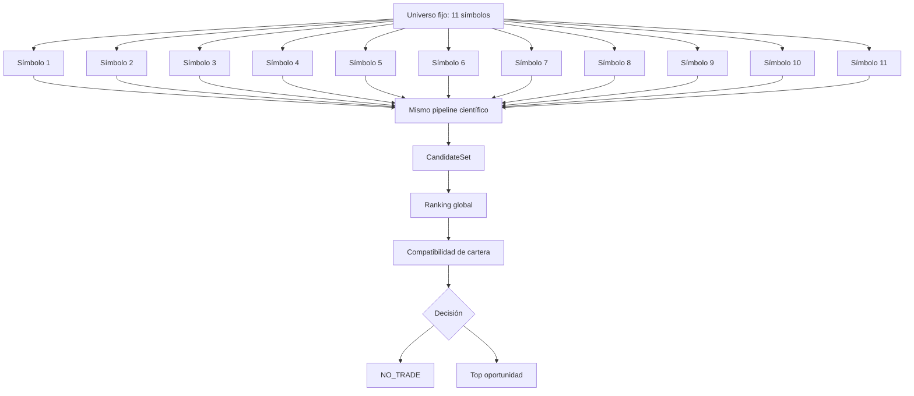
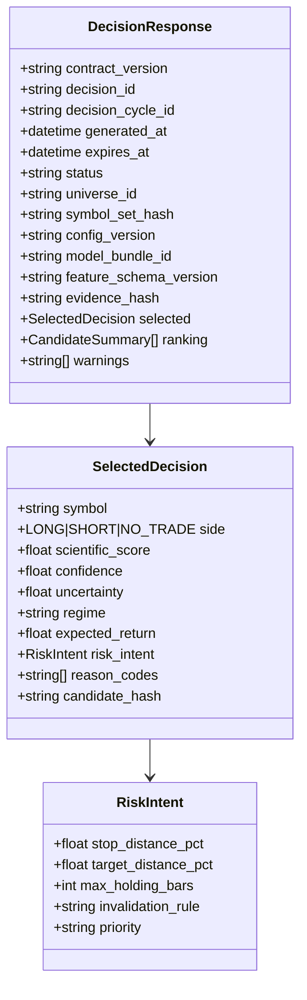
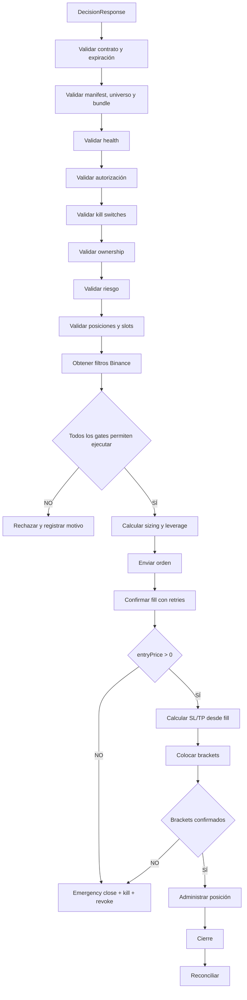
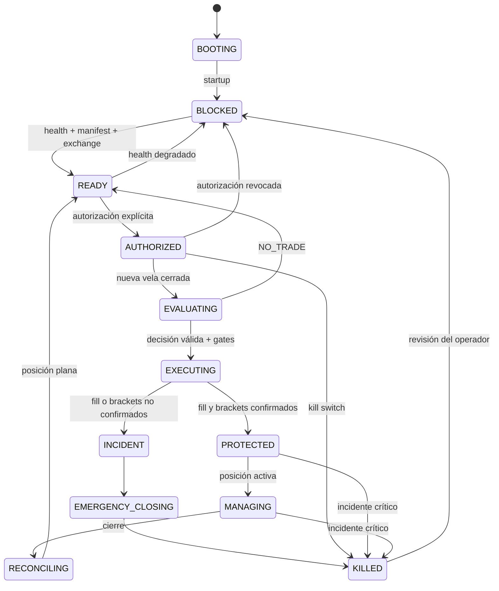
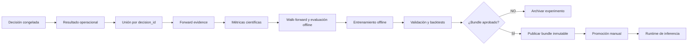

# Aegis Clean Rebuild
## Diagrama por capas del cerebro científico en Python y la ejecución en TypeScript

> **Objetivo:** representar cómo el sistema recibe datos de los 11 símbolos, procesa la información mediante capas científicas, selecciona una oportunidad, entrega una señal al bot de TypeScript y ejecuta la operación de forma segura.

---

# 1. Vista general por capas

```mermaid
flowchart TB
    subgraph L0["CAPA 0 — MERCADO Y DATOS OPERACIONALES · TypeScript"]
        BNB["Binance Futures"]
        WS["WebSocket de mercado"]
        REST["REST de respaldo"]
        CANDLES["Velas cerradas y validadas"]
        UNIVERSE["Universo fijo de 11 símbolos"]
        SNAPSHOT["Snapshot coordinado del ciclo"]

        BNB --> WS
        BNB --> REST
        WS --> CANDLES
        REST --> CANDLES
        UNIVERSE --> SNAPSHOT
        CANDLES --> SNAPSHOT
    end

    subgraph L1["CAPA 1 — CONTRATO Y VALIDACIÓN DE ENTRADA · Python"]
        REQUEST["DecisionRequest versionado"]
        SCHEMA["Validación de schema"]
        TIME["Validación temporal"]
        QUALITY["Calidad de datos"]
        HASH["Validación de universo, config y hashes"]
        NORMALIZED["MarketSnapshot normalizado"]

        REQUEST --> SCHEMA
        SCHEMA --> TIME
        TIME --> QUALITY
        QUALITY --> HASH
        HASH --> NORMALIZED
    end

    SNAPSHOT --> REQUEST

    subgraph L2["CAPA 2 — FEATURE ENGINEERING · Python"]
        BASE["Features base\nretornos, rango, volumen, volatilidad"]
        TEMPORAL["Features temporales\nmomentum, persistencia, aceleración"]
        CROSS["Features cross-sectional\nranking y fuerza relativa entre 11 símbolos"]
        REGIME_FEATURES["Features de régimen\ncontexto global y transición"]
        SCALE["Normalización congelada"]
        FEATURE_BATCH["FeatureBatch versionado"]

        BASE --> TEMPORAL
        TEMPORAL --> CROSS
        CROSS --> REGIME_FEATURES
        REGIME_FEATURES --> SCALE
        SCALE --> FEATURE_BATCH
    end

    NORMALIZED --> BASE

    subgraph L3["CAPA 3 — MODELOS PREDICTIVOS · Python"]
        REGISTRY["Model Registry\nbundles aprobados y hashes"]
        MODEL_A["Modelo secuencial\nLSTM / Transformer"]
        MODEL_B["Modelo auxiliar\ncalibración o contexto"]
        ENSEMBLE["Ensamble de predicciones"]
        RAW_PRED["Predicción por símbolo\nprobabilidades, retorno esperado e incertidumbre"]

        REGISTRY --> MODEL_A
        REGISTRY --> MODEL_B
        FEATURE_BATCH --> MODEL_A
        FEATURE_BATCH --> MODEL_B
        MODEL_A --> ENSEMBLE
        MODEL_B --> ENSEMBLE
        ENSEMBLE --> RAW_PRED
    end

    subgraph L4["CAPA 4 — CAPAS CIENTÍFICAS DE ROBUSTEZ · Python"]
        D3["D3\nDetección de régimen y contexto"]
        RV2["RV2\nRiesgo y estabilidad del entorno"]
        TRRM["TRRM\nCompatibilidad temporal y de régimen"]
        QMAE["QMAE\nCalidad, error esperado e incertidumbre"]
        EQM["EQM\nCalidad del ensamble y desacuerdo"]
        ECON1["ECON1\nViabilidad económica de la señal"]
        SCI_OUTPUT["ScientificLayerOutput\nscore calibrado + razones + penalizaciones"]

        RAW_PRED --> D3
        D3 --> RV2
        RV2 --> TRRM
        TRRM --> QMAE
        QMAE --> EQM
        EQM --> ECON1
        ECON1 --> SCI_OUTPUT
    end

    subgraph L5["CAPA 5 — CONSTRUCCIÓN DE CANDIDATOS · Python"]
        CANDIDATE["Candidate por símbolo"]
        SIDE["Dirección\nLONG / SHORT / NO_TRADE"]
        SCORE["Score científico"]
        CONF["Confianza e incertidumbre"]
        RISK_INTENT["Risk Intent\nstop %, target %, horizonte, invalidación"]
        REASONS["Reason codes y evidencia"]
        CANDIDATE_SET["CandidateSet de 11 símbolos"]

        SCI_OUTPUT --> CANDIDATE
        CANDIDATE --> SIDE
        CANDIDATE --> SCORE
        CANDIDATE --> CONF
        CANDIDATE --> RISK_INTENT
        CANDIDATE --> REASONS
        SIDE --> CANDIDATE_SET
        SCORE --> CANDIDATE_SET
        CONF --> CANDIDATE_SET
        RISK_INTENT --> CANDIDATE_SET
        REASONS --> CANDIDATE_SET
    end

    subgraph L6["CAPA 6 — SELECTION POLICY Y DECISION FREEZE · Python"]
        GATES["Gates científicos\nthreshold, régimen, calidad, incertidumbre"]
        RANK["Ranking global de los 11 símbolos"]
        PORTFOLIO["Compatibilidad de cartera\nslots, concentración, dirección y cooldowns"]
        SELECT["Selección de la mejor oportunidad"]
        NO_TRADE["Resultado válido: NO_TRADE"]
        FREEZE["Decision Freeze\ninmutable, idempotente y con hash"]
        DECISION["DecisionResponse"]

        CANDIDATE_SET --> GATES
        GATES --> RANK
        RANK --> PORTFOLIO
        PORTFOLIO --> SELECT
        SELECT --> NO_TRADE
        SELECT --> FREEZE
        NO_TRADE --> DECISION
        FREEZE --> DECISION
    end

    subgraph L7["CAPA 7 — CONTRATO PYTHON ↔ TYPESCRIPT"]
        CONTRACT["Contrato versionado"]
        DID["decision_id y candidate_hash"]
        EXP["expires_at"]
        PROPOSAL["Propuesta científica\nsímbolo, dirección, score, confidence y risk intent"]
        MANIFEST["Manifest handshake\nuniverso, bundle, config y feature schema"]

        DECISION --> CONTRACT
        CONTRACT --> DID
        CONTRACT --> EXP
        CONTRACT --> PROPOSAL
        MANIFEST --> CONTRACT
    end

    subgraph L8["CAPA 8 — GATES OPERACIONALES · TypeScript"]
        VERIFY["Validar contrato, hash y expiración"]
        HEALTH["Health y disponibilidad"]
        AUTH["EXECUTION_AUTHORIZED"]
        KILL["Kill switches"]
        OWNERSHIP["Ownership y posición existente"]
        RISK["Riesgo operacional\nnotional, pérdida diaria, slots y cooldown"]
        FILTERS["Filtros Binance\ntickSize, stepSize, minQty y minNotional"]
        CAN_EXECUTE{"¿Puede ejecutarse?"}
        REJECT["Rechazo operacional trazable"]

        PROPOSAL --> VERIFY
        VERIFY --> HEALTH
        HEALTH --> AUTH
        AUTH --> KILL
        KILL --> OWNERSHIP
        OWNERSHIP --> RISK
        RISK --> FILTERS
        FILTERS --> CAN_EXECUTE
        CAN_EXECUTE -->|NO| REJECT
    end

    subgraph L9["CAPA 9 — EJECUCIÓN Y CONFIRMACIÓN · TypeScript"]
        SIZE["Sizing y leverage"]
        ORDER["Crear orden de entrada"]
        FILL_RETRY["Confirmación del fill\nretries + backoff"]
        ENTRY["entryPrice autoritativo > 0"]
        BRACKET_BUILD["Calcular SL y TP desde el fill real"]
        BRACKET_PLACE["Colocar brackets"]
        BRACKET_VERIFY["Confirmar brackets en Binance"]
        PROTECTED{"¿Posición protegida?"}
        EMERGENCY["Emergency close + kill + revoke authorization"]

        CAN_EXECUTE -->|SÍ| SIZE
        SIZE --> ORDER
        ORDER --> FILL_RETRY
        FILL_RETRY --> ENTRY
        ENTRY --> BRACKET_BUILD
        BRACKET_BUILD --> BRACKET_PLACE
        BRACKET_PLACE --> BRACKET_VERIFY
        BRACKET_VERIFY --> PROTECTED
        PROTECTED -->|NO| EMERGENCY
    end

    subgraph L10["CAPA 10 — GESTIÓN DE POSICIÓN · TypeScript"]
        MANAGE["Position Manager"]
        PG["Profit Guardian"]
        TRAIL["Trailing"]
        TIME_EXIT["Time exit"]
        SLTP["SL / TP"]
        CLOSE["Cierre normal o protegido"]
        RECON["Reconciliación\nposición, órdenes y PnL"]
        FLAT["Estado final\n0 posición + 0 órdenes residuales"]

        PROTECTED -->|SÍ| MANAGE
        MANAGE --> PG
        MANAGE --> TRAIL
        MANAGE --> TIME_EXIT
        MANAGE --> SLTP
        PG --> CLOSE
        TRAIL --> CLOSE
        TIME_EXIT --> CLOSE
        SLTP --> CLOSE
        CLOSE --> RECON
        RECON --> FLAT
    end

    subgraph L11["CAPA 11 — EVIDENCIA Y APRENDIZAJE"]
        SCI_EVID["Evidencia científica\nfeatures, modelos, capas, ranking y freeze"]
        OPS_EVID["Evidencia operacional\norden, fill, brackets, gestión y cierre"]
        OUTCOME["DecisionOutcome normalizado"]
        FORWARD["Forward evidence"]
        OFFLINE["Evaluación y reentrenamiento offline"]
        BUNDLE["Nuevo bundle aprobado"]
        PROMOTE["Promoción manual y versionada"]

        DECISION --> SCI_EVID
        ORDER --> OPS_EVID
        ENTRY --> OPS_EVID
        BRACKET_VERIFY --> OPS_EVID
        RECON --> OPS_EVID
        SCI_EVID --> OUTCOME
        OPS_EVID --> OUTCOME
        OUTCOME --> FORWARD
        FORWARD --> OFFLINE
        OFFLINE --> BUNDLE
        BUNDLE --> PROMOTE
        PROMOTE --> REGISTRY
    end
```



---

# 2. Cómo toma una decisión el cerebro de Python

```mermaid
flowchart LR
    A["Snapshot válido de 11 símbolos"] --> B["Construir features por símbolo"]
    B --> C["Construir contexto transversal"]
    C --> D["Ejecutar modelos"]
    D --> E["Aplicar D3"]
    E --> F["Aplicar RV2"]
    F --> G["Aplicar TRRM"]
    G --> H["Aplicar QMAE"]
    H --> I["Aplicar EQM"]
    I --> J["Aplicar ECON1"]
    J --> K["Crear 11 candidatos"]
    K --> L["Filtrar candidatos inválidos"]
    L --> M["Rankear candidatos válidos"]
    M --> N["Aplicar compatibilidad de cartera"]
    N --> O{"¿Existe oportunidad válida?"}
    O -->|NO| P["NO_TRADE"]
    O -->|SÍ| Q["Seleccionar mejor candidato"]
    Q --> R["Congelar decisión"]
    R --> S["Entregar DecisionResponse a TypeScript"]
```



## Regla central

Python no responde:

```text
Compra 33 contratos de SUI a este precio.
```

Python responde conceptualmente:

```text
La mejor oportunidad científica de este ciclo es:

- símbolo: SUIUSDT
- dirección: SHORT
- score: 0.84
- confidence: 0.79
- uncertainty: 0.11
- régimen: bearish-expansion
- expected_return: 0.013
- risk_intent:
    stop_distance_pct: 0.006
    target_distance_pct: 0.012
    max_holding_bars: 8
```

TypeScript decide si esa propuesta puede convertirse en una operación real.

---

# 3. Robustez de los modelos y las capas

La robustez no depende de un único modelo. Surge de varias barreras consecutivas.

| Capa | Pregunta que responde | Resultado |
|---|---|---|
| Validación | ¿Los datos son completos, recientes y coherentes? | Acepta o rechaza el snapshot |
| Features | ¿Cómo se representa el mercado de forma estable? | `FeatureBatch` |
| Modelos | ¿Qué dirección y retorno parecen más probables? | Predicciones base |
| D3 | ¿En qué régimen se encuentra el mercado? | Contexto de régimen |
| RV2 | ¿El entorno presenta riesgo o inestabilidad excesiva? | Penalización o veto |
| TRRM | ¿La señal es compatible con el régimen y el momento? | Compatibilidad temporal |
| QMAE | ¿La predicción tiene suficiente calidad y bajo error esperado? | Confianza calibrada |
| EQM | ¿Los modelos están de acuerdo y el ensamble es consistente? | Score de calidad |
| ECON1 | ¿El edge esperado compensa la fricción? | Viabilidad económica |
| Candidate Builder | ¿Cuál es la propuesta completa por símbolo? | 11 candidatos |
| Selection Policy | ¿Cuál es la mejor oportunidad global? | Selección o `NO_TRADE` |
| Decision Freeze | ¿La decisión es inmutable, trazable e idempotente? | Decisión congelada |

---

# 4. Evaluación de los 11 símbolos



Los símbolos no se evalúan como once bots aislados. Después de evaluar cada uno, el sistema compara:

- fuerza relativa;
- score científico;
- confianza;
- incertidumbre;
- régimen;
- concentración;
- correlación;
- exposición existente;
- slots disponibles;
- dirección dominante;
- viabilidad económica.

---

# 5. Contrato de decisión Python → TypeScript



## Python no entrega

- cantidad final;
- notional;
- leverage aplicado;
- `tickSize`;
- `stepSize`;
- precio final de entrada;
- stop final;
- take profit final;
- `orderId`;
- `positionSide`;
- `reduceOnly`;
- comandos de cierre.

---

# 6. Decisión y ejecución en TypeScript



---

# 7. Máquina de estados operacional



## Invariantes

1. Reiniciar PM2 no autoriza ejecución.
2. `health_ready` no implica autorización.
3. Un kill switch prevalece sobre cualquier señal.
4. Sin autorización no se abren nuevas posiciones.
5. Revocar autorización no abandona una posición existente.
6. Una posición no se considera protegida hasta confirmar ambos brackets.
7. Una decisión expirada no puede ejecutarse.
8. Una decisión duplicada no puede abrir dos posiciones.
9. Una señal Python nunca puede saltarse los gates de TypeScript.
10. Todo incidente crítico termina fail-closed.

---

# 8. Bucle de evidencia y aprendizaje



El sistema no se autoentrena ni cambia modelos durante una operación. Todo entrenamiento ocurre offline y un bundle nuevo solo entra en producción después de validación y promoción explícita.

---

# 9. Separación de responsabilidades

| Responsabilidad | Python | TypeScript |
|---|:---:|:---:|
| Validar velas científicamente | ✅ | ✅ validación de feed |
| Construir features | ✅ | ❌ |
| Ejecutar modelos | ✅ | ❌ |
| D3 / RV2 / TRRM / QMAE / EQM / ECON1 | ✅ | ❌ |
| Ranking de 11 símbolos | ✅ | ❌ |
| Selección científica | ✅ | ❌ |
| Generar `NO_TRADE` | ✅ | ✅ respetarlo |
| Autorización | ❌ | ✅ |
| Kill switches | ❌ | ✅ |
| Sizing | ❌ | ✅ |
| Leverage | ❌ | ✅ |
| Filtros Binance | ❌ | ✅ |
| Crear órdenes | ❌ | ✅ |
| Confirmar fill | ❌ | ✅ |
| Calcular brackets finales | ❌ | ✅ |
| Administrar posición | ❌ | ✅ |
| Emergency close | ❌ | ✅ |
| Reconciliación | ❌ | ✅ |
| Evidencia científica | ✅ | recibe outcome |
| Evidencia operacional | recibe outcome | ✅ |

---

# 10. Resultado conceptual del sistema

```text
Python:

“Después de evaluar los 11 símbolos, aplicar modelos,
regímenes, calidad, incertidumbre y viabilidad económica,
la mejor oportunidad científica es X.”

TypeScript:

“Validaré si esa oportunidad puede operarse de forma real.
Si autorización, riesgo, ownership, salud y Binance lo permiten,
calcularé el tamaño, ejecutaré, confirmaré el fill,
protegeré la posición y la administraré.”

Sistema completo:

“Si cualquier capa no puede demostrar que el siguiente paso
es válido y seguro, no se abre una nueva operación.”
```

---

# 11. Principios finales de robustez

- Un solo cerebro científico.
- Un solo ejecutor operacional.
- Once símbolos evaluados conjuntamente.
- Varios modelos, pero un contrato común.
- Capas científicas consecutivas.
- Ranking global y determinista.
- `NO_TRADE` como resultado válido.
- Decisiones congeladas e idempotentes.
- TypeScript conserva el veto final.
- Fill real antes de calcular brackets.
- Brackets obligatorios y confirmados.
- Fail closed ante cualquier inconsistencia.
- Evidencia científica y operacional unificada.
- Entrenamiento offline.
- Bundles inmutables y promocionados manualmente.
