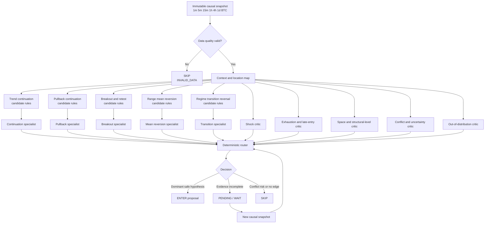
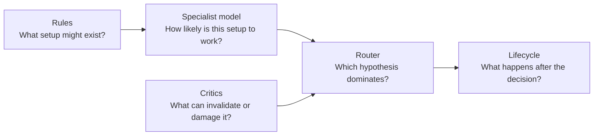
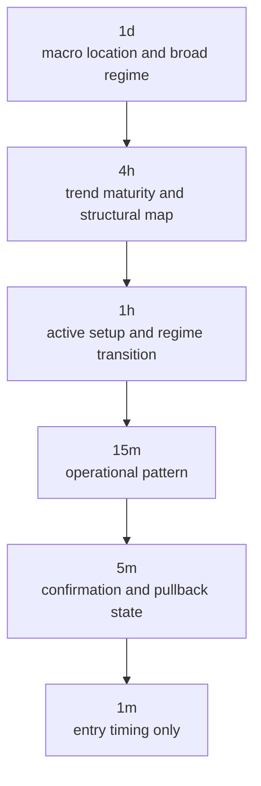
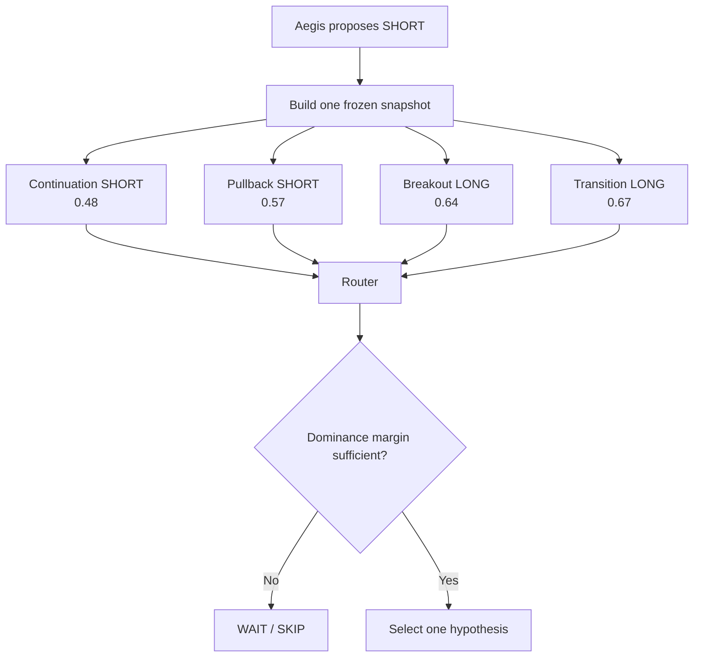
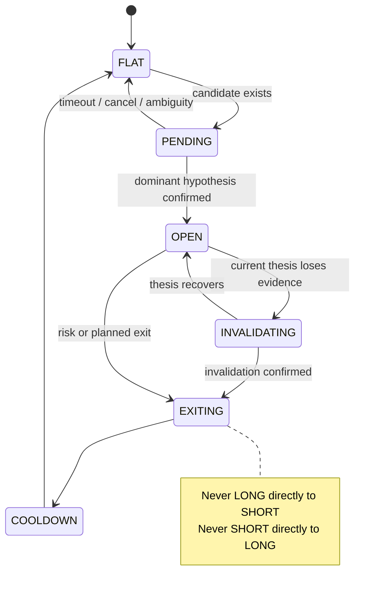

# Visual System Map

## Complete decision flow

## Separation of responsibilities

Rules do not estimate profitability. Models do not define what a strategy is.
Critics do not propose the opposite direction. The router does not manufacture
features or retrain specialists.

## Multi-timeframe interpretation

Higher timeframes provide context, not automatic vetoes. Their importance is
conditioned on the planned holding horizon. A short-lived setup may oppose 1d,
but it must then meet stricter timing, space, and invalidation requirements.

## Competing hypotheses example

The numeric values are illustrative. Opposing specialists may be evaluated for
research, but an Aegis signal-conditioned deployment cannot flip direction
unless a separately approved directional-routing experiment exists.

## Position lifecycle

Entry arbitration and position management remain separate experiments. The
first implementation evaluates only `FLAT -> PENDING -> ENTER/SKIP`.

