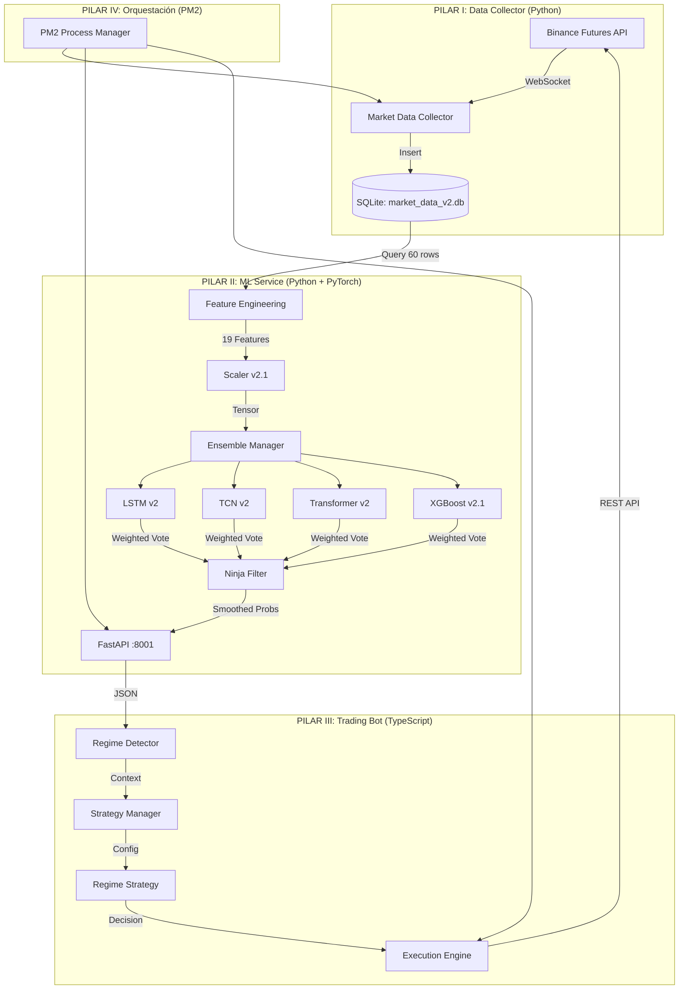

# 🥷 NINJA Trading System v4.0 - Technical Whitepaper

**Versión:** 4.0 (Regime-Adaptive Architecture)  
**Fecha:** 2 de Enero, 2026  
**Estado:** Producción (Estable)

---

## 1. Resumen Ejecutivo

El **NINJA Trading System v4.0** es un sistema de trading algorítmico de alta frecuencia diseñado para operar en mercados de futuros de criptomonedas. Opera bajo una arquitectura de **4 Pilares** con adaptación dinámica al régimen de mercado.

**Filosofía Central:**
> *"Entrada Probabilística, Salida Determinista, Adaptación por Régimen."*

### 1.1 Evolución del Sistema

| Versión | Nombre | Características Clave |
|---------|--------|----------------------|
| **v1.0** | Basic Bot | Modelo único, stops fijos, sin adaptación |
| **v2.0** | Consejo de Sabios | Ensemble de 4 modelos, trailing stops, Ninja Filter |
| **v3.0** | Ninja System | Detección de regímenes, parámetros dinámicos |
| **v4.0** | Regime-Adaptive | YAML config, hysteresis, estrategias por régimen |

---

## 2. Arquitectura de 4 Pilares



---

## 3. PILAR I: Recolección de Datos

**Proceso:** `02-Data-Collector` (Python)  
**Archivo:** `scripts/next_gen/market_data_collector.py`  
**Frecuencia:** 10 segundos (Snapshot)  
**Símbolos Activos:** 21 pares

### 3.1 Símbolos Monitoreados

```python
SYMBOLS = [
    'BTC/USDT:USDT', 'ETH/USDT:USDT', 'ADA/USDT:USDT', 'AVAX/USDT:USDT', 
    'SOL/USDT:USDT', 'XRP/USDT:USDT', 'LINK/USDT:USDT', 'DOGE/USDT:USDT', 
    'BNB/USDT:USDT', 'POL/USDT:USDT', 'DOT/USDT:USDT', 'LTC/USDT:USDT', 
    'UNI/USDT:USDT', 'ATOM/USDT:USDT', 'NEAR/USDT:USDT', '1000PEPE/USDT:USDT', 
    'FET/USDT:USDT', 'SEI/USDT:USDT', 'WLD/USDT:USDT', 'INJ/USDT:USDT', 
    'APT/USDT:USDT'
]
```

### 3.2 Esquema de Base de Datos

**Tabla: `orderbook_metrics`** (Snapshots de microestructura)

| Campo | Tipo | Descripción |
|-------|------|-------------|
| `timestamp` | INTEGER | Unix timestamp (ms) |
| `symbol` | TEXT | Par de trading |
| `obi_5` | REAL | Order Book Imbalance (Top 5 niveles) [-1, 1] |
| `obi_10` | REAL | OBI (Top 10 niveles) |
| `obi_20` | REAL | OBI (Top 20 niveles) |
| `spread_pct` | REAL | Spread bid-ask en porcentaje |
| `mid_price` | REAL | Precio medio |
| `micro_price` | REAL | Precio ponderado por volumen |
| `bid_depth_20` | REAL | Profundidad de compra (20 niveles) |
| `ask_depth_20` | REAL | Profundidad de venta (20 niveles) |

**Tabla: `derivatives_data`** (Datos de derivados)

| Campo | Tipo | Descripción |
|-------|------|-------------|
| `timestamp` | INTEGER | Unix timestamp (ms) |
| `symbol` | TEXT | Par de trading |
| `funding_rate` | REAL | Tasa de financiamiento |
| `open_interest` | REAL | Interés abierto en contratos |
| `taker_buy_vol` | REAL | Volumen de compra agresiva |
| `taker_sell_vol` | REAL | Volumen de venta agresiva |

### 3.3 Cálculo de OBI (Order Book Imbalance)

```python
def calculate_obi(bids, asks, depth):
    bid_vol = sum(b[1] for b in bids[:depth])
    ask_vol = sum(a[1] for a in asks[:depth])
    
    if (bid_vol + ask_vol) == 0:
        return 0
        
    return (bid_vol - ask_vol) / (bid_vol + ask_vol)
```

**Interpretación:**
- `OBI > 0.3`: Presión compradora dominante
- `OBI < -0.3`: Presión vendedora dominante
- `OBI ≈ 0`: Equilibrio

---

## 4. PILAR II: Servicio de Machine Learning

**Proceso:** `03-ML-Service-V2` (Python FastAPI)  
**Archivo:** `services/ml_service_v2.py`  
**Puerto:** 8001  
**GPU:** NVIDIA RTX 3060 (12GB VRAM)

### 4.1 El Comité de Sabios (Ensemble)

El corazón del sistema es un comité de 4 modelos que votan sobre la dirección del mercado.

| Modelo | Arquitectura | Peso | Especialidad |
|--------|--------------|------|--------------|
| **LSTM** | 2-Layer LSTM (64 units) | 30% | Memoria de largo plazo, detecta ciclos |
| **TCN** | Dilated ConvNet [32, 64] | 30% | Patrones visuales, rupturas abruptas |
| **XGBoost** | Gradient Boosting | 25% | Decisiones nítidas con meta-features |
| **Transformer** | Encoder-only (4 heads) | 15% | Relaciones no lineales complejas |

### 4.2 Feature Engineering (19 Dimensiones)

**A. Microestructura (13 features base):**

1. `bid_depth` - Profundidad de compra
2. `ask_depth` - Profundidad de venta
3. `bid_ask_spread` - Spread
4. `obi_5` - OBI 5 niveles
5. `obi_10` - OBI 10 niveles
6. `obi` - OBI 20 niveles
7. `micro_price` - Precio ponderado
8. `funding_rate` - Tasa de financiamiento
9. `open_interest` - Interés abierto
10. `taker_buy_vol` - Volumen compra
11. `taker_sell_vol` - Volumen venta
12. `buy_sell_ratio` - Ratio compra/venta
13. `depth_imbalance` - Desequilibrio de profundidad

**B. Meta-Features (6 features derivadas):**

```python
# Calculadas sobre ventana de 12 ticks (2 minutos)
df['mean_obi_12'] = df['obi'].rolling(12).mean()
df['max_obi_12'] = df['obi'].rolling(12).max()
df['std_obi_12'] = df['obi'].rolling(12).std()
df['slope_price_12'] = df['price'].rolling(12).apply(linregress_slope)
df['mean_volume_12'] = taker_vol.rolling(12).mean()
df['volume_trend'] = taker_vol / df['mean_volume_12']
```

### 4.3 Mecanismo de Votación Ponderada

```python
# Combinación ponderada de predicciones
P_final = Σ(P_i × W_i) / Σ(W_i)

# Donde:
#   P_i = Probabilidad del modelo i [Short, Neutral, Long]
#   W_i = Peso del modelo i
```

### 4.4 Filtro Ninja (EMA Asimétrica)

**Problema:** El ruido de alta frecuencia causa señales falsas.  
**Solución:** Suavizado asimétrico - escéptico para subir, paranoico para bajar.

```python
alpha = alpha_slow if raw > smoothed else alpha_fast
smoothed = alpha * raw + (1 - alpha) * smoothed

# Configuración v4.0:
alpha_slow = 0.15  # Subir despacio (confirmación)
alpha_fast = 0.70  # Bajar rápido (protección)
```

### 4.5 API Endpoint

```
POST /ml-v2/predict
Content-Type: application/json

Request:  { "symbol": "BTCUSDT" }
Response: {
    "symbol": "BTCUSDT",
    "long_prob": 0.35,
    "short_prob": 0.45,
    "neutral_prob": 0.20,
    "consensus_level": 0.78,
    "meta_verdict": "SHORT_BIAS"
}
```

---

## 5. PILAR III: Bot de Trading

**Proceso:** `01-Trading-Bot` (TypeScript)  
**Directorio:** `binance-futures-bot-ts/`  
**Ciclo:** 5000ms (configurable)

### 5.1 Sistema de Detección de Regímenes

El bot analiza el estado del mercado y selecciona una estrategia apropiada.

**Archivo:** `src/app/core/RegimeDetector.ts`

#### 5.1.1 Inputs del Detector

```typescript
interface MarketSnapshot {
    spreadPct: number;     // Volatilidad (spread)
    obi: number;           // Order Book Imbalance
    fundingRate: number;   // Sentimiento macro
    longProb: number;      // Probabilidad ML Long
    shortProb: number;     // Probabilidad ML Short
    neutralProb: number;   // Probabilidad ML Neutral
}
```

#### 5.1.2 Clasificación de Volatilidad

```typescript
private classifyVolatility(spreadPct: number): 'LOW' | 'MED' | 'HIGH' {
    if (spreadPct > 0.0015) return 'HIGH';  // > 0.15%
    if (spreadPct > 0.0008) return 'MED';   // > 0.08%
    return 'LOW';
}
```

#### 5.1.3 Clasificación de Sesgo (Bias)

```typescript
private classifyBias(longProb: number, shortProb: number): 'BULL' | 'BEAR' | 'NEUTRAL' {
    const diff = longProb - shortProb;
    if (diff > 0.20) return 'BULL';
    if (diff < -0.20) return 'BEAR';
    return 'NEUTRAL';
}
```

#### 5.1.4 Matriz de Regímenes

| Volatilidad | Bias | Régimen | Descripción |
|-------------|------|---------|-------------|
| HIGH | + Confusión | BLOODBATH | Caos, scalping rápido |
| MED | BULL/BEAR | WHALE | Tendencia fuerte |
| LOW | BULL/BEAR | WHALE | Tendencia suave |
| LOW | NEUTRAL | MONK | Rango lateral |
| Otro | - | BUNKER | Incertidumbre, no operar |

### 5.2 Configuración por Régimen (YAML)

**Archivo:** `regime_config.live.yaml`

```yaml
REGIMES:
  BLOODBATH: { leverage: 15, entry_threshold: 0.30, hard_stop_roe: -0.015, tp_roe: 0.005 }
  WHALE:     { leverage: 5,  entry_threshold: 0.50, hard_stop_roe: -0.20,  tp_roe: 999.0 }
  MONK:      { leverage: 10, entry_threshold: 0.40, hard_stop_roe: -0.05,  tp_roe: 0.02 }
  BUNKER:    { leverage: 0,  entry_threshold: 999.0, hard_stop_roe: 0.0,   tp_roe: 0.0 }

SYMBOL_OVERRIDES:
  BTCUSDT:
    WHALE: { leverage: 3, entry_threshold: 0.55, hard_stop_roe: -0.25 }
```

### 5.3 Hysteresis (Anti-Flickering)

**Problema:** El régimen cambiaba cada 15 segundos, causando cierres inmediatos.  
**Solución:** Candado de 60 segundos.

```typescript
private readonly REGIME_STICKY_THRESHOLD = 12; // 12 ticks × 5s = 60s

private applyHysteresis(rawRegime: RegimeType): RegimeType {
    if (rawRegime === this.lastRegime) {
        this.regimeStickyCounter = this.REGIME_STICKY_THRESHOLD;
        return this.lastRegime;
    }
    
    this.regimeStickyCounter--;
    
    if (this.regimeStickyCounter <= 0) {
        this.lastRegime = rawRegime;
        this.regimeStickyCounter = this.REGIME_STICKY_THRESHOLD;
        return rawRegime;
    }
    
    return this.lastRegime; // Mantener régimen anterior
}
```

### 5.4 Estrategias por Régimen

#### 5.4.1 BLOODBATH Strategy (Scalping en Caos)

```yaml
leverage: 15x
entry_threshold: 30%
hard_stop: -1.5%
take_profit: +0.5%
max_hold: 2 minutos
```

**Lógica:** Entrar rápido, salir más rápido. Aprovechar wicks de pánico.

#### 5.4.2 WHALE Strategy (Seguir Tendencia)

```yaml
leverage: 5x
entry_threshold: 50%
hard_stop: -20%
trailing_activation: +3%
trailing_drawdown: 50% del pico
```

**Lógica:** Montar la ola. Trailing stop protege ganancias.

#### 5.4.3 MONK Strategy (Range Trading)

```yaml
leverage: 10x
entry_threshold: 40%
hard_stop: -5%
take_profit: +2%
```

**Lógica:** Comprar abajo, vender arriba. Precisión en rangos.

#### 5.4.4 BUNKER Strategy (Protección)

```yaml
leverage: 0x
entry_threshold: 999% (nunca)
```

**Lógica:** NO OPERAR. Si hay posición abierta:
- Si ROI < -5%: Cerrar (hard stop)
- Si Peak > 1% y ROI < 50% del peak: Cerrar (trailing)
- Sino: Mantener (dejar que el mercado decida)

### 5.5 Sistema de Salidas (Smart Exit)

**Archivo:** `src/app/strategy-runner.ts` (1217 líneas)

#### 5.5.1 Capa 1: Pánico (Panic Reversal)
- **Trigger:** Probabilidad opuesta > 50%
- **Acción:** Cierre inmediato MARKET

#### 5.5.2 Capa 2: Neutralidad (Profit Taking)
- **Trigger:** ROI > 5% AND Neutral > 60%
- **Acción:** Cerrar y asegurar ganancia

#### 5.5.3 Capa 3: Trailing Stop Escalonado
```
Si ROI < 30%:  Trail = 40% del pico
Si ROI > 30%:  Trail = 20% del pico
Si ROI > 50%:  Trail = 10% del pico
```

---

## 6. PILAR IV: Orquestación con PM2

**Archivo:** `ecosystem.config.js` (implícito)

### 6.1 Procesos Gestionados

| ID | Nombre | Descripción | Estado |
|----|--------|-------------|--------|
| 0 | `01-Trading-Bot` | Bot de ejecución TypeScript | ✅ Online |
| 1 | `02-Data-Collector` | Recolector de microestructura | ✅ Online |
| 2 | `04-Daily-Retrain` | Re-entrenamiento diario | ⏸️ Stopped |
| 3 | `03-ML-Service-V2` | API ML FastAPI | ✅ Online |

### 6.2 Comandos Operativos

```bash
# Ver estado
pm2 list

# Ver logs en tiempo real
pm2 logs 01-Trading-Bot --lines 50

# Reiniciar bot
pm2 restart 01-Trading-Bot --update-env

# Reiniciar todo
pm2 restart all
```

---

## 7. Entrenamiento de Modelos

### 7.1 Pipeline de Entrenamiento

**Directorio:** `ml/advanced_models/`

```
1. Carga de datos    → SQLite (últimos 30 días)
2. Feature Eng       → 19 dimensiones
3. Split temporal    → 80% train / 20% test
4. Entrenamiento     → 4 modelos en paralelo (GPU)
5. Evaluación        → Accuracy, F1, Confusion Matrix
6. Guardado          → models/v2_ensemble/{symbol}/
```

### 7.2 Arquitecturas de Modelos

**LSTM v2:**
```python
class DeepLSTM(nn.Module):
    def __init__(self, input_size, hidden_size=64, num_layers=2):
        self.lstm = nn.LSTM(input_size, hidden_size, num_layers, batch_first=True)
        self.fc = nn.Linear(hidden_size, 3)  # [Short, Neutral, Long]
```

**TCN v2:**
```python
class TemporalConvNet(nn.Module):
    def __init__(self, input_size, channels=[32, 64], kernel_size=3):
        self.tcn = TCN(input_size, channels, kernel_size, dropout=0.2)
        self.fc = nn.Linear(channels[-1], 3)
```

**XGBoost v2.1:**
```python
XGBClassifier(
    n_estimators=200,
    max_depth=6,
    learning_rate=0.1,
    objective='multi:softprob'
)
```

### 7.3 Re-entrenamiento Diario

**Script:** `04-Daily-Retrain` (PM2)

```
Horario: 00:00 UTC (cron)
Datos: Últimos 30 días
Símbolos: 9 activos
Duración: ~2 horas en RTX 3060
```

---

## 8. Hardware y Requisitos

### 8.1 Especificaciones del Sistema

| Componente | Especificación |
|------------|----------------|
| **CPU** | Intel Core i3-10100F @ 3.60GHz (4 cores, 8 threads) |
| **RAM** | 8 GB DDR4 |
| **Almacenamiento** | 1TB NVMe SSD (914GB disponibles) |
| **OS** | Ubuntu 24.04.3 LTS |
| **Python** | 3.12.3 |
| **Node.js** | v20.19.6 LTS |

### 8.2 Arquitectura Multi-GPU (3 tarjetas)

El sistema utiliza una arquitectura híbrida con división de tareas por GPU:

| GPU | Modelo | VRAM | Rol |
|-----|--------|------|-----|
| **NVIDIA** | GeForce GTX 1660 | 6 GB | **Inferencia** (ML Service v2 - 24/7) |
| **AMD #1** | Radeon RX 6600 | 8 GB | **Entrenamiento** (Daily Retrain) |
| **AMD #2** | Radeon RX 6600 MECH 2X | 8 GB | **Entrenamiento** (Paralelo/Backup) |

**Estrategia de División:**
- La **NVIDIA GTX 1660** está dedicada exclusivamente al servicio de inferencia (`03-ML-Service-V2`), garantizando baja latencia en predicciones 24/7.
- Las **AMD RX 6600** se utilizan para el re-entrenamiento diario de modelos, aprovechando ROCm para PyTorch.

### 8.3 Entornos Virtuales

```bash
# Inferencia (NVIDIA CUDA)
.venv_cuda/     # PyTorch + CUDA para GTX 1660

# Entrenamiento (AMD ROCm)
.venv_rocm62/   # PyTorch + ROCm 6.2 para RX 6600
```

### 8.4 Dependencias Clave

**Python (Inferencia - CUDA):**
```
torch==2.1.0+cu121
xgboost==2.0.0
fastapi==0.104.0
uvicorn==0.24.0
ccxt==4.1.0
pandas==2.1.0
numpy==1.26.0
```

**Python (Entrenamiento - ROCm):**
```
torch==2.1.0+rocm6.2
xgboost==2.0.0
scikit-learn==1.3.0
```

**Node.js (Bot):**
```
typescript: ^5.0.0
js-yaml: ^4.1.0
axios: ^1.6.0
```

---

## 9. Variables de Entorno

**Archivo:** `binance-futures-bot-ts/.env`

```bash
# API Keys
BINANCE_API_KEY=xxx
BINANCE_SECRET_KEY=xxx

# Configuración
SYMBOLS=DOGEUSDT:10:0.75,BTCUSDT:10:0.60,...
REGIME_CONFIG=/path/to/regime_config.live.yaml

# ML Service
ML_SERVICE_URL=http://localhost:8001
```

---

## 10. Métricas de Rendimiento

### 10.1 Accuracy de Modelos (Validación)

| Símbolo | Accuracy | Error |
|---------|----------|-------|
| BTC/USDT | 98.4% | 1.57% |
| ETH/USDT | 95.9% | 4.07% |
| XRP/USDT | 97.6% | 2.35% |
| SOL/USDT | 96.1% | 3.90% |

### 10.2 Backtesting v4.0

**Período:** 14 días  
**Resultado BTC:** +2.23% (16 trades, 93.75% win rate)

---

## 11. Troubleshooting

### 11.1 Problema: Trades se cierran inmediatamente

**Causa:** Régimen flickering (MONK → BUNKER → MONK)  
**Solución:** Aumentar `REGIME_STICKY_THRESHOLD` (default: 12 ticks = 60s)

### 11.2 Problema: Bot no entra en trades

**Causa:** Todos los símbolos en BUNKER  
**Diagnóstico:**
```bash
pm2 logs 01-Trading-Bot --lines 50 | grep regime_status
```
**Solución:** Verificar que la lógica de detección incluye WHALE para LOW+BEAR.

### 11.3 Problema: ML Service no responde

**Diagnóstico:**
```bash
curl http://localhost:8001/ml-v2/predict -X POST -H "Content-Type: application/json" -d '{"symbol":"BTCUSDT"}'
```
**Solución:** `pm2 restart 03-ML-Service-V2`

---

## 12. Herramientas CLI y Utilidades

### 12.1 Comandos de Consola (~/bin)

Los siguientes comandos están disponibles globalmente desde cualquier directorio:

| Comando | Descripción |
|---------|-------------|
| `audit_bot` | Descarga y analiza trades de Binance |
| `trading_report` | Muestra reportes formateados en consola |

**Configuración de symlinks:**
```bash
# Ubicación: ~/bin/
ls -la ~/bin/
# audit_bot -> .../binance-futures-bot-ts/analysis/audit_bot.py
# trading_report -> .../binance-futures-bot-ts/analysis/view_console_report.py
```

### 12.2 Audit Bot (Forensic Analysis)

**Archivo:** `binance-futures-bot-ts/analysis/audit_bot.py`

Herramienta de análisis forense que descarga el historial de trades de Binance y genera reportes.

**Uso:**
```bash
# Operaciones de hoy
audit_bot --today

# Última semana, solo ganancias
audit_bot --week --status WIN

# Filtrar por símbolo
audit_bot --symbol SOLUSDT

# Últimos N días
audit_bot --days 14
```

**Output:**
- `operations_history.csv` - Historial en CSV
- `chart_equity.png` - Curva de equity
- `chart_pnl_symbol.png` - PnL por símbolo

### 12.3 Trading Report

**Archivo:** `binance-futures-bot-ts/analysis/view_console_report.py`

Lee el CSV generado por `audit_bot` y muestra un reporte formateado:

```bash
trading_report
```

**Secciones del Reporte:**
1. Signos Vitales (PnL, Win Rate, Profit Factor, Max Drawdown)
2. Análisis LONG vs SHORT
3. Hall of Fame (Top 5 victorias)
4. Hall of Shame (Top 5 pérdidas)
5. Detalle de Wins
6. Detalle de Losses
7. Bitácora completa

---

## 13. Grid Search y Optimización

### 13.1 Symbol Grid Search

**Archivo:** `scripts/symbol_grid_search.py`

Herramienta para encontrar la mejor configuración de régimen para cada símbolo.

**Uso:**
```bash
# Grid search con 7 días de datos
python scripts/symbol_grid_search.py --days 7

# Símbolos específicos
python scripts/symbol_grid_search.py --symbols BTCUSDT,ETHUSDT --days 14
```

### 13.2 Escenarios Predefinidos

| Escenario | Leverage | Hard Stop | Entry Threshold | Descripción |
|-----------|----------|-----------|-----------------|-------------|
| **DEFAULT** | 10x | -5% | 50% | Configuración base |
| **TORTUGA** | 3x | -20% | 55% | Conservador, más margen |
| **SANGRIENTO** | 20x | -2% | 40% | Agresivo, alto riesgo |
| **CAZADOR** | 10x | -5% | 35% | Entry fácil, mismo riesgo |

### 13.3 Output del Grid Search

```
reports/
├── grid_search_YYYYMMDD_HHMMSS.txt    # Reporte legible
└── symbol_grid_search_results.json    # Datos estructurados
```

**Formato de Resultados:**
```yaml
SYMBOL_OVERRIDES:
  BTCUSDT:
    WHALE: { leverage: 3, entry_threshold: 0.55, hard_stop_roe: -0.25 }
  SOLUSDT:
    MONK: { leverage: 15, entry_threshold: 0.35, hard_stop_roe: -0.03 }
```

---

## 14. Biblioteca de Scripts (90+)

**Directorio:** `scripts/` (92 archivos)

### 14.1 Categorías

| Categoría | Scripts | Descripción |
|-----------|---------|-------------|
| **Training** | `train_*.py` (12) | Entrenamiento de modelos |
| **Analysis** | `analyze_*.py` (9) | Análisis de datos y modelos |
| **Backtest** | `backtest_*.py` (3) | Simulación histórica |
| **Grid Search** | `grid_search_*.py` (5) | Optimización de parámetros |
| **Data** | `collect_*.py`, `download_*.py` | Recolección de datos |
| **Diagnostics** | `diagnose_*.py`, `debug_*.py` | Troubleshooting |

### 14.2 Scripts Clave

| Script | Función |
|--------|---------|
| `backtest_system_v2.py` | Backtester completo con ML |
| `train_v2_production.py` | Training pipeline producción |
| `symbol_grid_search.py` | Optimizador de regímenes |
| `daily_retrain.sh` | Re-entrenamiento diario |
| `collect_historical_data.py` | Descarga datos históricos |

---

## 15. Arquitectura de Directorios

```
trading_system/
├── binance-futures-bot-ts/       # Bot TypeScript
│   ├── src/app/
│   │   ├── core/                 # RegimeDetector, NinjaConfigManager
│   │   ├── regimes/              # Strategies (Bloodbath, Whale, Monk, Bunker)
│   │   └── strategy-runner.ts    # Lógica principal
│   ├── analysis/                 # audit_bot, trading_report
│   ├── data/                     # Estado, orders_book.json
│   ├── logs/                     # history-*.log
│   └── regime_config.live.yaml   # Config producción
│
├── services/
│   └── ml_service_v2.py          # FastAPI ML Service
│
├── ml/
│   └── advanced_models/          # Arquitecturas de modelos
│
├── models/
│   └── v2_ensemble/              # Modelos entrenados por símbolo
│
├── scripts/                      # 92 utilidades
├── data/                         # market_data_v2.db
├── config/                       # settings.py
└── system_whitepaper.md          # Este documento
```

---

## 16. Roadmap Futuro

- [ ] Multi-exchange support (Bybit, OKX)
- [ ] Optimización de hiperparámetros con Optuna
- [ ] Dashboard web para monitoreo
- [ ] Alertas por Telegram/Discord
- [ ] Grid Search automatizado semanal
- [ ] Migración a PostgreSQL para escalabilidad
- [ ] API de control remoto (start/stop/status)

---

## 17. Glosario

| Término | Definición |
|---------|------------|
| **OBI** | Order Book Imbalance - Desequilibrio entre compra/venta [-1, 1] |
| **Régimen** | Estado del mercado (BLOODBATH, WHALE, MONK, BUNKER) |
| **Hysteresis** | Retardo intencional de 60s para evitar cambios rápidos de régimen |
| **Trailing Stop** | Stop loss dinámico que sigue al precio cuando está en ganancia |
| **Ensemble** | Combinación ponderada de 4 modelos ML (LSTM, TCN, XGBoost, Transformer) |
| **ROI** | Return on Investment - Porcentaje de ganancia/pérdida |
| **ROE** | Return on Equity - ROI considerando el leverage |
| **Ninja Filter** | EMA asimétrica para suavizar señales ML |
| **Grid Search** | Búsqueda exhaustiva de parámetros óptimos |
| **Funding Rate** | Tasa de financiamiento en futuros perpetuos |
| **Peak ROE** | Máximo ROI alcanzado en una posición |
| **CCXT** | Librería unificada para exchanges de crypto |

---

**© 2026 NINJA Trading System v4.0. Documento interno - No distribuir.**

