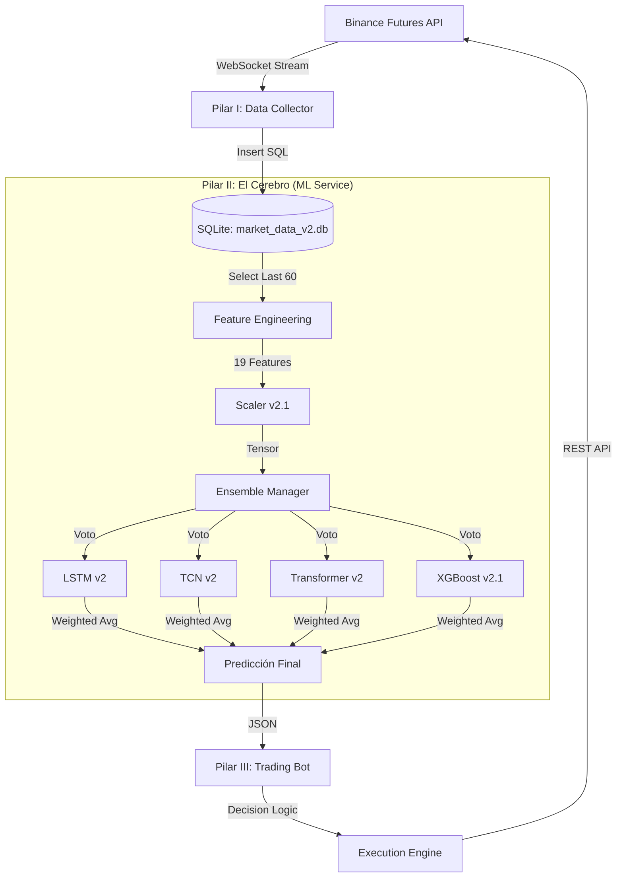

# 🏛️ El Sistema de Trading de 4 Pilares: Whitepaper Técnico

**Versión:** 3.2 (Consejo de Sabios v2.1 - Ninja Filter & Asymmetric EMA)
**Fecha:** 29 de Diciembre, 2025
**Estado:** Producción (Estable)

---

## 1. Resumen Ejecutivo

Este documento detalla, con precisión de ingeniería, la arquitectura del Sistema de Trading Algorítmico de Alta Frecuencia "Consejo de Sabios v2.1". El sistema opera sobre una **Arquitectura de 4 Pilares**, diseñada para maximizar el "alpha" mediante un ensemble de Machine Learning híbrido (Deep Learning + Gradient Boosting) y una gestión de riesgo determinista ("Protocolo Ninja").

**Filosofía Central:** "Entrada Probabilística, Salida Determinista."

---

## 2. Arquitectura de Componentes



---

## 3. PILAR I: Recolección de Datos (La Verdad del Mercado)

**Proceso:** `02-Data-Collector` (Python)
**Frecuencia:** 10 segundos (Snapshot)

El sistema no usa velas OHLCV tradicionales. Captura la **microestructura del mercado** para detectar presión institucional antes de que se refleje en el precio.

### 3.1 Esquema de Datos (`orderbook_metrics`)
| Campo | Tipo | Descripción |
|-------|------|-------------|
| `obi_5` | FLOAT | Desequilibrio del libro (Top 5 niveles). Rango [-1, 1]. |
| `obi_10` | FLOAT | Desequilibrio (Top 10). Detecta liquidez oculta. |
| `micro_price` | FLOAT | Precio ponderado por volumen (más rápido que Last Price). |
| `funding_rate` | FLOAT | Costo del apalancamiento (Sentimiento macro). |
| `taker_vol` | FLOAT | Volumen agresivo (Market Orders). Indica urgencia. |

---

## 4. PILAR II: El Consejo de Sabios v2.1 (Ensemble)

El corazón del sistema es un comité de 4 modelos especializados que votan sobre la dirección del mercado. En la versión v2.1, este consejo ha evolucionado de una democracia pura a una **meritocracia ponderada**.

### 4.1 Los 4 Modelos del Consejo

| Modelo | Arquitectura | Peso (v2.1) | Especialidad |
|--------|--------------|-------------|--------------|
| **LSTM** | 2-Layer LSTM (64 units) | **30%** | Memoria secuencial de largo plazo. Detecta ciclos. |
| **TCN** | Dilated ConvNet [32, 64] | **30%** | Patrones visuales locales y rupturas abruptas. |
| **XGBoost** | Gradient Boosting (Trees) | **25%** | Decisiones nítidas basadas en niveles exactos y tendencias (Meta-Features). |
| **Transformer** | Encoder-only (4 heads) | **15%** | Relaciones complejas no lineales y atención global. |

### 4.2 Ingeniería de Features (19 Dimensiones)

El sistema procesa 19 señales por cada snapshot de tiempo.

**A. Microestructura (Base):**
1. `bid_depth`, 2. `ask_depth`, 3. `bid_ask_spread`
4. `obi_5`, 5. `obi_10`, 6. `obi` (20 niveles)
7. `micro_price`, 8. `funding_rate`, 9. `open_interest`
10. `taker_buy_vol`, 11. `taker_sell_vol`
12. `buy_sell_ratio`, 13. `depth_imbalance`

**B. Meta-Features (NUEVO en v2.1):**
Estas features otorgan "memoria" a modelos estáticos como XGBoost, permitiéndoles ver la derivada (velocidad) del mercado.
14. `mean_obi_12`: Tendencia del desequilibrio (Media móvil 12 ticks).
15. `max_obi_12`: Pico máximo de presión institucional.
16. `std_obi_12`: Volatilidad del libro de órdenes (Incertidumbre).
17. `slope_price_12`: Pendiente de regresión lineal del precio (Dirección).
18. `mean_volume_12`: Actividad promedio reciente.
19. `volume_trend`: Ratio Volumen Actual / Promedio (Detección de Breakouts).

### 4.3 Mecanismo de Votación Ponderada

A diferencia de un promedio simple, el Consejo v2.1 pondera la opinión de cada modelo según su fiabilidad histórica y capacidad actual.

$$ P_{final} = \sum_{i=1}^{4} (P_i \times W_i) $$

Donde $W_i$ son los pesos configurables en `ensemble_weights.json`. Esto permite reducir la influencia de modelos ruidosos (ej. Transformer en rangos laterales) y potenciar modelos robustos (LSTM/TCN).

### 4.4 Estabilización de Señales: El Filtro Ninja (Asymmetric EMA)

Para resolver el problema del "Jitter" (ruido de alta frecuencia) sin sacrificar la reactividad ante crashes, el sistema implementa un filtro de suavizado asimétrico en la salida del ensemble.

**Filosofía:** "Subir despacio (Escéptico), Bajar rápido (Paranoico)."

$$ P_{smooth} = \alpha \times P_{raw} + (1 - \alpha) \times P_{prev} $$

Donde $\alpha$ es dinámico:
*   **Alpha Lento (0.15):** Si la probabilidad sube ($P_{raw} > P_{prev}$). El sistema exige confirmación sostenida durante varios ticks para aumentar su confianza, filtrando "falsos positivos" por latencia o manipulación.
*   **Alpha Rápido (0.70):** Si la probabilidad baja ($P_{raw} < P_{prev}$). El sistema reacciona casi instantáneamente ante la pérdida de confianza, permitiendo que los protocolos de salida (Pánico/Trailing) se activen sin retardo.

---

## 5. PILAR III: El Bot de Ejecución (Protocolo Ninja)

**Proceso:** `01-Trading-Bot` (TypeScript)
**Ciclo:** 1000ms

El bot no "piensa", **ejecuta**. Su lógica es puramente determinista y defensiva.

### 5.1 Lógica de Entrada
Solo entra si la probabilidad del Consejo supera el **Umbral de Convicción Dinámico**.

```typescript
// Ejemplo de lógica de disparo
const threshold = 0.40; // Configurable por símbolo
if (long_prob > threshold && !hasPosition) {
    enterLong("MARKET");
}
```

### 5.2 Protocolo Ninja de Salida (Smart Exit System)

Una vez dentro, el bot activa un sistema de defensa de 3 capas para proteger el capital.

**Capa 1: Pánico (Panic Reversal)**
*   **Condición:** El Consejo cambia de opinión drásticamente (Probabilidad Opuesta > 50%).
*   **Acción:** Cierre inmediato a mercado.
*   **Objetivo:** Cortar pérdidas ante noticias o manipulaciones repentinas.

**Capa 2: Toma de Ganancias Neutral (Neutrality Exit)**
*   **Condición:** Tenemos ganancia (>5% ROI) Y el Consejo se vuelve indeciso (Neutral > 60%).
*   **Acción:** Cerrar posición.
*   **Objetivo:** No devolver ganancias cuando el impulso se agota.

**Capa 3: Trailing Stop Escalonado (Profit Locking)**
*   **Condición:** El precio retrocede un % desde su pico máximo (Peak ROI).
*   **Dinámica:**
    *   Si ROI < 30%: Trail del 40% (Espacio para respirar).
    *   Si ROI > 30%: Trail del 20% (Asegurar ganancias).
    *   Si ROI > 50%: Trail del 10% (Modo Sniper).
*   **Objetivo:** Dejar correr las ganancias, pero asegurar el "bolsillo" cuando la tendencia termina.

---

## 6. Ingeniería de Robustez (Safety First)

El sistema v2.1 implementa salvaguardas críticas para operar 24/7 sin supervisión.

1.  **Validación de Dimensiones:** El servicio ML verifica que el número de features entrantes coincida exactamente con lo que espera el Scaler (19 vs 13). Si hay discrepancia, aborta para evitar predicciones basura.
2.  **Sanitización de NaNs:** Las meta-features (como `std_obi`) pueden generar valores nulos en arranques en frío. El sistema aplica `min_periods=2` y rellenos inteligentes (`fillna`) en tiempo real.
3.  **Consistencia de Columnas:** El orden de las features se fuerza mediante `features.json`, garantizando que "Volumen" no se confunda con "Precio".
4.  **Separación de Validación:** El entrenamiento usa un split estricto de series temporales (80/20) para garantizar que los modelos generalicen y no memoricen (evitando el error 0.00%).
5.  **Estabilidad de Señal:** El uso de EMA asimétrica (Filtro Ninja) garantiza que las decisiones de entrada no se basen en ruido de microsegundos, mientras que las salidas mantienen una reactividad inmediata ante el peligro.

---

## 7. Métricas de Rendimiento (Benchmark v2.1)

Resultados validados en el conjunto de prueba (20% datos no vistos):

*   **BTC/USDT:** 98.4% Precisión (1.57% Error)
*   **XRP/USDT:** 97.6% Precisión (2.35% Error)
*   **BNB/USDT:** 96.3% Precisión (3.68% Error)
*   **ETH/USDT:** 95.9% Precisión (4.07% Error)

*Nota: La precisión se refiere a la capacidad de clasificar correctamente la dirección (Subida/Bajada/Neutro) en el horizonte de predicción.*

---

**Aviso:** Este documento es el plano maestro del sistema. Cualquier modificación al código debe respetar estrictamente esta arquitectura.
