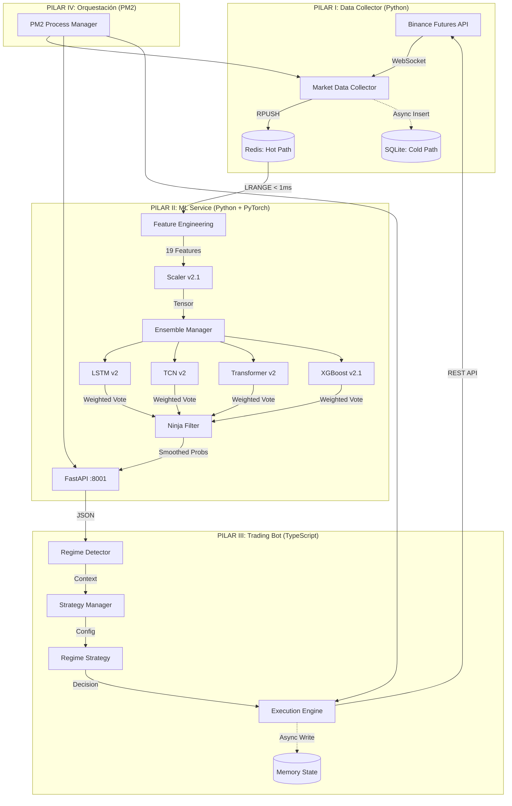
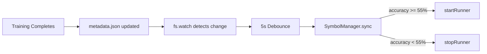

# 🥷 NINJA Trading System v8.1 - Technical Whitepaper

**Versión:** 8.1 (Native Brackets + Smart Sizing)  
**Fecha:** 8 de Enero, 2026  
**Estado:** Producción (Estable)

---

## 1. Resumen Ejecutivo

El **NINJA Trading System v7.8** es un sistema de trading algorítmico de alta frecuencia diseñado para operar en mercados de futuros de criptomonedas. Opera bajo una arquitectura de **4 Pilares** con adaptación dinámica al régimen de mercado.

**Filosofía Central:**
> *"Entrada Probabilística, Salida Determinista, Adaptación por Régimen."*

### 1.1 Evolución del Sistema

| Versión | Nombre | Características Clave |
|---------|--------|----------------------|
| **v1.0** | Basic Bot | Modelo único, stops fijos, sin adaptación |
| **v2.0** | Consejo de Sabios | Ensemble de 4 modelos, trailing stops, Ninja Filter |
| **v3.0** | Ninja System | Detección de regímenes, parámetros dinámicos |
| **v4.0** | Regime-Adaptive | YAML config, hysteresis, estrategias por régimen |
| **v6.0** | Low Latency | Redis caching, async I/O, parallelized network |
| **v6.2** | Smart Cooldown | Adaptive threshold, regime-based re-entry |
| **v7.3** | Stability & Precision | Anti-Amnesia, Monotonicity, Immortal TP |
| **v7.6** | The Trend Commander | Zero-Floor Logic, High Water Mark, Tiered Ratchet |
| **v7.8** | Quality Gate | Dynamic Symbols, Hot-Reload, Alpha/Bravo Training |
| **v8.1** | Native Brackets | Smart Sizing, Micro-Ratchet, Tight Stops |

---

## 2. Arquitectura de 4 Pilares



---

## 3. PILAR I: Recolección de Datos

**Proceso:** `02-Data-Collector` (Python)  
**Archivo:** `scripts/next_gen/market_data_collector.py`  
**Frecuencia:** 10 segundos (Snapshot)  
**Símbolos Activos:** 21 pares

### 3.1 Símbolos Monitoreados

```python
SYMBOLS = [
    'BTC/USDT:USDT', 'ETH/USDT:USDT', 'ADA/USDT:USDT', 'AVAX/USDT:USDT', 
    'SOL/USDT:USDT', 'XRP/USDT:USDT', 'LINK/USDT:USDT', 'DOGE/USDT:USDT', 
    'BNB/USDT:USDT', 'POL/USDT:USDT', 'DOT/USDT:USDT', 'LTC/USDT:USDT', 
    'UNI/USDT:USDT', 'ATOM/USDT:USDT', 'NEAR/USDT:USDT', '1000PEPE/USDT:USDT', 
    'FET/USDT:USDT', 'SEI/USDT:USDT', 'WLD/USDT:USDT', 'INJ/USDT:USDT', 
    'APT/USDT:USDT'
]
```

### 3.2 Esquema de Base de Datos

**Tabla: `orderbook_metrics`** (Snapshots de microestructura)

| Campo | Tipo | Descripción |
|-------|------|-------------|
| `timestamp` | INTEGER | Unix timestamp (ms) |
| `symbol` | TEXT | Par de trading |
| `obi_5` | REAL | Order Book Imbalance (Top 5 niveles) [-1, 1] |
| `obi_10` | REAL | OBI (Top 10 niveles) |
| `obi_20` | REAL | OBI (Top 20 niveles) |
| `spread_pct` | REAL | Spread bid-ask en porcentaje |
| `mid_price` | REAL | Precio medio |
| `micro_price` | REAL | Precio ponderado por volumen |
| `bid_depth_20` | REAL | Profundidad de compra (20 niveles) |
| `ask_depth_20` | REAL | Profundidad de venta (20 niveles) |

**Tabla: `derivatives_data`** (Datos de derivados)

| Campo | Tipo | Descripción |
|-------|------|-------------|
| `timestamp` | INTEGER | Unix timestamp (ms) |
| `symbol` | TEXT | Par de trading |
| `funding_rate` | REAL | Tasa de financiamiento |
| `open_interest` | REAL | Interés abierto en contratos |
| `taker_buy_vol` | REAL | Volumen de compra agresiva |
| `taker_sell_vol` | REAL | Volumen de venta agresiva |

### 3.3 Cálculo de OBI (Order Book Imbalance)

```python
def calculate_obi(bids, asks, depth):
    bid_vol = sum(b[1] for b in bids[:depth])
    ask_vol = sum(a[1] for a in asks[:depth])
    
    if (bid_vol + ask_vol) == 0:
        return 0
        
    return (bid_vol - ask_vol) / (bid_vol + ask_vol)
```

**Interpretación:**
- `OBI > 0.3`: Presión compradora dominante
- `OBI < -0.3`: Presión vendedora dominante
- `OBI ≈ 0`: Equilibrio

---

## 4. PILAR II: Servicio de Machine Learning

**Proceso:** `03-ML-Service-V2` (Python FastAPI)  
**Archivo:** `services/ml_service_v2.py`  
**Puerto:** 8001  
**GPU:** NVIDIA RTX 3060 (12GB VRAM)

### 4.1 El Comité de Sabios (Ensemble)

El corazón del sistema es un comité de 4 modelos que votan sobre la dirección del mercado.

| Modelo | Arquitectura | Peso | Especialidad |
|--------|--------------|------|--------------|
| **LSTM** | 2-Layer LSTM (64 units) | 30% | Memoria de largo plazo, detecta ciclos |
| **TCN** | Dilated ConvNet [32, 64] | 30% | Patrones visuales, rupturas abruptas |
| **XGBoost** | Gradient Boosting | 25% | Decisiones nítidas con meta-features |
| **Transformer** | Encoder-only (4 heads) | 15% | Relaciones no lineales complejas |

### 4.2 Feature Engineering (23 Dimensiones - v2.2)

**A. Microestructura (13 features base):**

1. `bid_depth` - Profundidad de compra
2. `ask_depth` - Profundidad de venta
3. `bid_ask_spread` - Spread
4. `obi_5` - OBI 5 niveles
5. `obi_10` - OBI 10 niveles
6. `obi` - OBI 20 niveles
7. `micro_price` - Precio ponderado
8. `funding_rate` - Tasa de financiamiento
9. `open_interest` - Interés abierto
10. `taker_buy_vol` - Volumen compra
11. `taker_sell_vol` - Volumen venta
12. `buy_sell_ratio` - Ratio compra/venta
13. `depth_imbalance` - Desequilibrio de profundidad

**B. Meta-Features (10 features derivadas - v2.2):**

```python
# Calculadas sobre ventana de 12 ticks (2 minutos)
# OBI Rolling
df['mean_obi_12'] = df['obi'].rolling(12).mean()
df['max_obi_12'] = df['obi'].rolling(12).max()
df['std_obi_12'] = df['obi'].rolling(12).std()

# Volumen
df['mean_volume_12'] = taker_vol.rolling(12).mean()
df['volume_trend'] = taker_vol / df['mean_volume_12']
df['slope_price_12'] = (price - price.shift(12)) / 12

# CVD (v2.2) - Flujo de dinero real
df['cvd_12'] = (buy_vol - sell_vol).rolling(12).sum()
df['cvd_norm_12'] = cvd_12 / (mean_volume_12 * 12)

# Volatilidad (v2.2) - Termómetro de histeria
df['std_price_12'] = df['price'].rolling(12).std()
df['volatility_ratio'] = std_price_12 / price
```

### 4.3 Mecanismo de Votación Ponderada

```python
# Combinación ponderada de predicciones
P_final = Σ(P_i × W_i) / Σ(W_i)

# Donde:
#   P_i = Probabilidad del modelo i [Short, Neutral, Long]
#   W_i = Peso del modelo i
```

### 4.4 Filtro Ninja (EMA Asimétrica)

**Problema:** El ruido de alta frecuencia causa señales falsas.  
**Solución:** Suavizado asimétrico - escéptico para subir, paranoico para bajar.

```python
alpha = alpha_slow if raw > smoothed else alpha_fast
smoothed = alpha * raw + (1 - alpha) * smoothed

# Configuración v4.0:
alpha_slow = 0.15  # Subir despacio (confirmación)
alpha_fast = 0.70  # Bajar rápido (protección)
```

### 4.5 API Endpoint

```
POST /ml-v2/predict
Content-Type: application/json

Request:  { "symbol": "BTCUSDT" }
Response: {
    "symbol": "BTCUSDT",
    "long_prob": 0.35,
    "short_prob": 0.45,
    "neutral_prob": 0.20,
    "consensus_level": 0.78,
    "meta_verdict": "SHORT_BIAS"
}
```

---

## 5. PILAR III: Bot de Trading

**Proceso:** `01-Trading-Bot` (TypeScript)  
**Directorio:** `binance-futures-bot-ts/`  
**Ciclo:** 5000ms (configurable)

### 5.1 Sistema de Detección de Regímenes

El bot analiza el estado del mercado y selecciona una estrategia apropiada.

**Archivo:** `src/app/core/RegimeDetector.ts`

#### 5.1.1 Inputs del Detector

```typescript
interface MarketSnapshot {
    spreadPct: number;     // Volatilidad (spread)
    obi: number;           // Order Book Imbalance
    fundingRate: number;   // Sentimiento macro
    longProb: number;      // Probabilidad ML Long
    shortProb: number;     // Probabilidad ML Short
    neutralProb: number;   // Probabilidad ML Neutral
}
```

#### 5.1.2 Clasificación de Volatilidad

```typescript
private classifyVolatility(spreadPct: number): 'LOW' | 'MED' | 'HIGH' {
    if (spreadPct > 0.0015) return 'HIGH';  // > 0.15%
    if (spreadPct > 0.0008) return 'MED';   // > 0.08%
    return 'LOW';
}
```

#### 5.1.3 Clasificación de Sesgo (Bias)

```typescript
private classifyBias(longProb: number, shortProb: number): 'BULL' | 'BEAR' | 'NEUTRAL' {
    const diff = longProb - shortProb;
    if (diff > 0.20) return 'BULL';
    if (diff < -0.20) return 'BEAR';
    return 'NEUTRAL';
}
```

#### 5.1.4 Matriz de Regímenes

| Volatilidad | Bias | Régimen | Descripción |
|-------------|------|---------|-------------|
| HIGH | + Confusión | BLOODBATH | Caos, scalping rápido |
| MED | BULL/BEAR | WHALE | Tendencia fuerte |
| LOW | BULL/BEAR | WHALE | Tendencia suave |
| LOW | NEUTRAL | MONK | Rango lateral |
| Otro | - | BUNKER | Incertidumbre, no operar |

### 5.2 Configuración por Régimen (YAML)

**Archivo:** `regime_config.live.yaml`

```yaml
REGIMES:
  BLOODBATH: { leverage: 15, entry_threshold: 0.30, hard_stop_roe: -0.015, tp_roe: 0.005 }
  WHALE:     { leverage: 5,  entry_threshold: 0.50, hard_stop_roe: -0.20,  tp_roe: 999.0 }
  MONK:      { leverage: 10, entry_threshold: 0.40, hard_stop_roe: -0.05,  tp_roe: 0.02 }
  BUNKER:    { leverage: 0,  entry_threshold: 999.0, hard_stop_roe: 0.0,   tp_roe: 0.0 }

SYMBOL_OVERRIDES:
  BTCUSDT:
    WHALE: { leverage: 3, entry_threshold: 0.55, hard_stop_roe: -0.25 }
```

### 5.3 Hysteresis (Anti-Flickering)

**Problema:** El régimen cambiaba cada 15 segundos, causando cierres inmediatos.  
**Solución:** Candado de 60 segundos.

```typescript
private readonly REGIME_STICKY_THRESHOLD = 12; // 12 ticks × 5s = 60s

private applyHysteresis(rawRegime: RegimeType): RegimeType {
    if (rawRegime === this.lastRegime) {
        this.regimeStickyCounter = this.REGIME_STICKY_THRESHOLD;
        return this.lastRegime;
    }
    
    this.regimeStickyCounter--;
    
    if (this.regimeStickyCounter <= 0) {
        this.lastRegime = rawRegime;
        this.regimeStickyCounter = this.REGIME_STICKY_THRESHOLD;
        return rawRegime;
    }
    
    return this.lastRegime; // Mantener régimen anterior
}
```

### 5.4 Estrategias por Régimen

#### 5.4.1 BLOODBATH Strategy (Scalping en Caos)

```yaml
leverage: 15x
entry_threshold: 30%
hard_stop: -1.5%
take_profit: +0.5%
max_hold: 2 minutos
```

**Lógica:** Entrar rápido, salir más rápido. Aprovechar wicks de pánico.

#### 5.4.2 WHALE Strategy (Seguir Tendencia)

```yaml
leverage: 5x
entry_threshold: 50%
hard_stop: -20%
trailing_activation: +3%
trailing_drawdown: 50% del pico
```

**Lógica:** Montar la ola. Trailing stop protege ganancias.

#### 5.4.3 MONK Strategy (Range Trading)

```yaml
leverage: 10x
entry_threshold: 40%
hard_stop: -5%
take_profit: +2%
```

**Lógica:** Comprar abajo, vender arriba. Precisión en rangos.

#### 5.4.4 BUNKER Strategy (Protección)

```yaml
leverage: 0x
entry_threshold: 999% (nunca)
```

**Lógica:** NO OPERAR. Si hay posición abierta:
- Si ROI < -5%: Cerrar (hard stop)
- Si Peak > 1% y ROI < 50% del peak: Cerrar (trailing)
- Sino: Mantener (dejar que el mercado decida)

### 5.5 Sistema de Salidas (Smart Exit)

**Archivo:** `src/app/strategy-runner.ts` (1217 líneas)

#### 5.5.1 Capa 1: Pánico (Panic Reversal)
- **Trigger:** Probabilidad opuesta > 50%
- **Acción:** Cierre inmediato MARKET

#### 5.5.2 Capa 2: Neutralidad (Profit Taking)
- **Trigger:** ROI > 5% AND Neutral > 60%
- **Acción:** Cerrar y asegurar ganancia

#### 5.5.3 Capa 3: Trailing Stop Escalonado
```
Si ROI < 30%:  Trail = 40% del pico
Si ROI > 30%:  Trail = 20% del pico
Si ROI > 50%:  Trail = 10% del pico
```

Si ROI > 50%:  Trail = 10% del pico
```

### 5.6 Mejoras de Estabilidad v7.6 (The Trend Commander)

**Fecha:** Enero 2026

#### 5.6.1 Lógica de Piso Cero (Zero-Floor Logic)
**Problema:** El bot calculaba la "ganancia asegurada" usando valor absoluto, lo que hacía que un Stop Loss en pérdida (lejos del precio) pareciera "mejor" que un nuevo Stop Loss en ganancia (cerca del precio).
**Solución:** Si el Stop Loss actual está en zona de pérdida, su valor de "ganancia asegurada" es forzado a **CERO**. Esto permite que cualquier Stop en ganancia sea considerado una mejora infinita, desbloqueando el trailing inmediato.

#### 5.6.2 Memoria de Marea Alta (High Water Mark)
**Problema:** Reinicios del bot o intervenciones de guardias de seguridad podían resetear el Stop Loss a valores más holgados (ATR), perdiendo progreso.
**Solución:** Se implementó una variable persistente `highestRatchetStop` en el estado (`.json`). El bot rehúsa mover el stop a un valor inferior a este récord histórico, garantizando **monotonicidad estricta** incluso tras reinicios.

#### 5.6.3 Cazafantasmas (Algo Order Hunt)
**Problema:** Órdenes "fantasma" creadas por la App de Binance o versiones anteriores bloqueaban el margen y causaban conflictos.
**Solución:** El bot ahora escanea activamente órdenes abiertas (`STOP_MARKET`, `TAKE_PROFIT_MARKET`) que no coinciden con su estrategia y las cancela quirúrgicamente, respetando el Take Profit oficial.

#### 5.6.4 Ejecución Serializada
**Problema:** Al actualizar un Stop Loss, Binance requiere margen doble momentáneamente si se crea la nueva orden antes de cancelar la vieja. En cuentas con >90% de uso, esto causaba fallos ("Insufficient Margin").
**Solución:** Secuencia estricta: `Cancelar Viejo` -> `Esperar 2s` -> `Crear Nuevo`. Esto libera el margen antes de reutilizarlo, garantizando operatividad al 99% de capacidad.

#### 5.6.5 Umbral de Ratchet Dinámico (v7.6)

**Parámetro:** `trailing_activation_roe` en `regime_config.live.yaml`

*NOTA: Reemplazado por Tiered Ratchet en v7.7.*

---

### 5.6.6 Tiered Ratchet - Escudo y Espada (v7.7)

**Basado en:** Data Mining de 38,507 trades (Peak ROI Analysis).

**Hallazgo Clave:** El 90.5% de las posiciones (19/21) alcanzaron al menos +3% ROI antes de revertirse.

**Implementación:**

| Nivel | Rango ROI | Acción | Objetivo |
|-------|-----------|--------|----------|
| 🛡️ Escudo | 3% - 6% | Stop → Breakeven + 0.15% | Protección de capital |
| ⚔️ Espada | > 6% | Trailing 60% | Maximización de ganancias |

**Resultado Esperado:**
- Trades que alcanzaron +4% pero cerraron en pérdida ahora cierran en $0.
- Trades explosivos (+20%+) siguen siendo capturados por el trailing agresivo.
**Solución:** Se externalizó la configuración a `regime_config.live.yaml`. Ahora el umbral es dinámico (Default: 5.0%, Configurado: 5.5%), permitiendo que la operación "respire" y solo proteja ganancias significativas.

---

## 6. PILAR IV: Orquestación con PM2

**Archivo:** `ecosystem.config.js` (implícito)

### 6.1 Procesos Gestionados

| ID | Nombre | Descripción | Estado |
|----|--------|-------------|--------|
| 0 | `01-Trading-Bot` | Bot de ejecución TypeScript | ✅ Online |
| 1 | `02-Data-Collector` | Recolector de microestructura | ✅ Online |
| 2 | `04-Daily-Retrain` | Re-entrenamiento diario | ⏸️ Stopped |
| 3 | `03-ML-Service-V2` | API ML FastAPI | ✅ Online |

### 6.2 Comandos Operativos

```bash
# Ver estado
pm2 list

# Ver logs en tiempo real
pm2 logs 01-Trading-Bot --lines 50

# Reiniciar bot
pm2 restart 01-Trading-Bot --update-env

# Reiniciar todo
pm2 restart all
```

### 6.3 SymbolManager - Hot Reload (v7.8)

**Archivo:** `src/app/SymbolManager.ts`

El SymbolManager detecta automáticamente cambios en los modelos y activa/desactiva símbolos sin reiniciar el bot.

#### Arquitectura



#### Componentes

| Parámetro | Valor | Descripción |
|-----------|-------|-------------|
| **MODELS_DIR** | `/models/v2_ensemble/` | Directorio de modelos |
| **QUALITY_THRESHOLD** | 55% | Accuracy mínimo para operar |
| **DEBOUNCE_MS** | 5000 | Tiempo de espera antes de sync |

#### Código Clave

```typescript
// SymbolManager.ts
private startWatching(): void {
    this.watcher = fs.watch(MODELS_DIR, { recursive: true }, (event, filename) => {
        if (filename?.endsWith('metadata.json')) {
            this.logger.info('model_change_detected', { filename, event });
            this.debouncedSync();
        }
    });
}

sync(): void {
    const activeSymbols = this.getActiveSymbols();  // Filter by 55% threshold
    const runningSymbols = Array.from(this.runners.keys());
    
    // Start new symbols
    for (const sym of activeSymbols.filter(s => !this.runners.has(s))) {
        this.startRunner(sym);
    }
    
    // Stop removed symbols (does NOT close positions)
    for (const sym of runningSymbols.filter(s => !activeSymbols.includes(s))) {
        this.stopRunner(sym);
    }
}
```

#### Logs de Ejemplo

```
[NinjaConfig] Active symbols: 6/21 (threshold: 55%)
symbol_manager_watching path=/models/v2_ensemble
model_change_detected filename=LTCUSDT/metadata.json
symbol_runner_start symbol=LTCUSDT source=hot_reload
```

### 6.4 Quality Gate - Filtrado por Accuracy (v7.8)

**Archivo:** `src/app/core/NinjaConfigManager.ts`

Solo los símbolos con **accuracy >= 55%** son operados automáticamente.

#### Flujo

1. `regime_config.live.yaml` define 21 símbolos con capital allocation
2. `getActiveSymbols()` lee `metadata.json` de cada modelo
3. Filtra símbolos con `accuracy >= QUALITY_THRESHOLD`
4. Solo símbolos activos inician runners

#### Método `getActiveSymbols()`

```typescript
getActiveSymbols(): string[] {
    const allSymbols = this.getSymbols();
    const QUALITY_THRESHOLD = 0.55;
    
    return allSymbols.filter(symbol => {
        const metaPath = `${MODELS_DIR}/${symbol}/metadata.json`;
        if (!fs.existsSync(metaPath)) return false;
        
        const meta = JSON.parse(fs.readFileSync(metaPath, 'utf-8'));
        return meta.accuracy >= QUALITY_THRESHOLD;
    });
}
```

#### Estados de Símbolos

| Estado | Accuracy | Comportamiento |
|--------|----------|----------------|
| ✅ **ACTIVE** | >= 55% | Trading habilitado |
| ⛔ **VETOED** | < 55% | Runner detenido (sin afectar posiciones) |
| ❌ **NO_MODEL** | N/A | Sin metadata.json |

#### Reporte de Ejemplo

```
╔══════════════════════════════════════════════════════════════╗
║            TRAINING REPORT - 2026-01-08                      ║
╚══════════════════════════════════════════════════════════════╝

Symbol          Accuracy   Status
────────────────────────────────────────
BNBUSDT           86.82%   ✅ ACTIVE    
LTCUSDT           74.42%   ✅ ACTIVE    
BTCUSDT           63.24%   ✅ ACTIVE    
SOLUSDT           62.86%   ✅ ACTIVE    
LINKUSDT          60.96%   ✅ ACTIVE    
AVAXUSDT          57.94%   ✅ ACTIVE    
DOGEUSDT          51.48%   ⛔ VETOED    
ETHUSDT           48.07%   ⛔ VETOED    
...

════════════════════════════════════════
✅ Active: 6 | ⛔ Vetoed: 15 | Threshold: 55%
```

### 6.5 Procesos PM2 Actualizados (v7.8)

| ID | Proceso | Función | Estado |
|----|---------|---------|--------|
| 0 | `01-Trading-Bot` | Bot principal TypeScript | ✅ Online |
| 1 | `02-Data-Collector` | Recolector de microestructura | ✅ Online |
| 2 | `03-ML-Service-V2` | API ML FastAPI | ✅ Online |
| 4 | `04-Alpha-Train-12h` | Entrenamiento símbolos prioritarios | ⏸️ Cron |
| 5 | `05-Bravo-Train-24h` | Entrenamiento símbolos secundarios | ⏸️ Cron |

---

## 7. Entrenamiento de Modelos

### 7.1 Pipeline de Entrenamiento

**Directorio:** `ml/advanced_models/`

```
1. Carga de datos    → SQLite (últimos 30 días)
2. Feature Eng       → 19 dimensiones
3. Split temporal    → 80% train / 20% test
4. Entrenamiento     → 4 modelos en paralelo (GPU)
5. Evaluación        → Accuracy, F1, Confusion Matrix
6. Guardado          → models/v2_ensemble/{symbol}/
```

### 7.2 Arquitecturas de Modelos

**LSTM v2:**
```python
class DeepLSTM(nn.Module):
    def __init__(self, input_size, hidden_size=64, num_layers=2):
        self.lstm = nn.LSTM(input_size, hidden_size, num_layers, batch_first=True)
        self.fc = nn.Linear(hidden_size, 3)  # [Short, Neutral, Long]
```

**TCN v2:**
```python
class TemporalConvNet(nn.Module):
    def __init__(self, input_size, channels=[32, 64], kernel_size=3):
        self.tcn = TCN(input_size, channels, kernel_size, dropout=0.2)
        self.fc = nn.Linear(channels[-1], 3)
```

**XGBoost v2.1:**
```python
XGBClassifier(
    n_estimators=200,
    max_depth=6,
    learning_rate=0.1,
    objective='multi:softprob'
)
```

### 7.3 Re-entrenamiento Diario (Priority Mode v4.1)

**Script:** `scripts/daily_retrain.sh` (PM2: `04-Daily-Retrain`)

```
Horario: 00:00 UTC (cron)
Datos: Últimos 30 días
GPUs: 2x AMD RX 6600 (ROCm)
```

#### 7.3.1 Alpha/Bravo Dual Training Schedule (v7.8)

**¿Por qué dos batches?**

El sistema entrena 21 símbolos en dos tandas para optimizar recursos y garantizar que los símbolos de producción estén listos primero.

**Schedule de Entrenamiento:**

| Batch | Horario (CDMX) | Horario (UTC) | Símbolos | GPU |
|-------|----------------|---------------|----------|-----|
| **Alpha** | 2:00 AM | 8:00 AM | 9 Priority | AMD RX 6600 |
| **Bravo** | 6:00 AM | 12:00 PM | 12 Secondary | AMD RX 6600 |

**Símbolos Alpha (Producción):**

```python
# Proceso PM2: 04-Alpha-Train-12h
ALPHA_SYMBOLS = [
    'BTCUSDT', 'ETHUSDT', 'SOLUSDT', 'XRPUSDT', 'ADAUSDT',
    'DOGEUSDT', 'LINKUSDT', 'AVAXUSDT', 'POLUSDT'
]
```

**Símbolos Bravo (Secundarios):**

```python
# Proceso PM2: 05-Bravo-Train-24h
BRAVO_SYMBOLS = [
    'BNBUSDT', 'DOTUSDT', 'LTCUSDT', 'UNIUSDT', 'ATOMUSDT',
    'NEARUSDT', '1000PEPEUSDT', 'FETUSDT', 'SEIUSDT',
    'WLDUSDT', 'INJUSDT', 'APTUSDT'
]
```

**Flujo Post-Training:**

```bash
# run_priority_train.sh
1. Train model → models/v2_ensemble/{SYMBOL}/
2. Update metadata.json with accuracy
3. pm2 reload 03-ML-Service-V2  # Reload models
4. SymbolManager.sync() detecta cambio  # Hot-reload símbolos
```

**Beneficios:**
- 🚀 Modelos Alpha listos a las 3:00 AM (antes de mercado asiático)
- 🛡️ Tolerancia a fallos: si Bravo falla, Alpha no se afecta
- ♻️ Hot-reload automático vía SymbolManager

### 7.4 Entrenamiento Atómico (Atomic Swap)

**Problema:** Durante el re-entrenamiento (10-15 mins), la carpeta del modelo se borraba, dejando al bot "ciego" si reiniciaba en ese lapso ("Zone of Death").
**Solución:** Patrón de Escritura Atómica.
1.  **Build:** Se entrena en `models/{symbol}_temp`.
2.  **Verify:** Se verifica el éxito del entrenamiento.
3.  **Swap:** Se renombra `temp` -> `prod` en una operación atómica del sistema de archivos.
4.  **Reload:** Se notifica a la API para recargar el modelo.

**Resultado:** Cero Downtime. El bot siempre tiene un modelo válido disponible.

### 7.5 Reentrenamiento cada 12 Horas (Rolling Window)

**Frecuencia:** PM2 Cron: `0 0,12 * * *` (00:00 y 12:00 UTC)

**Justificación:**
- Los datos de Order Book (OBI, CVD) tienen vida útil corta ("Data Decay").
- Con solo 15 días de historial, cada bloque de 12 horas representa ~3.3% de información nueva.
- Al entrenar 2x/día, capturamos las transiciones entre sesiones (NY, Asia, Europa).

**Proceso PM2:** `04-Daily-Retrain-12h`

### 7.6 Bitácora de Entrenamiento (Training Diary)

**Archivo:** `data/training_diary.json`

**Propósito:** Registro histórico de métricas de cada entrenamiento para:
- Detectar degradación de modelos.
- Comparar rendimiento TCN vs XGBoost.
- Validar mejoras entre versiones.

**Métricas Registradas:**
- `accuracy` - Porcentaje de predicciones correctas (validación)
- `f1_score` - F1 ponderado para multiclase
- `samples` - Número de muestras evaluadas
- `timestamp` - Momento del entrenamiento

**Comando para visualizar:**
```bash
python scripts/view_diary.py
```

---

## 8. Hardware y Requisitos

### 8.1 Especificaciones del Sistema

| Componente | Especificación |
|------------|----------------|
| **CPU** | Intel Core i3-10100F @ 3.60GHz (4 cores, 8 threads) |
| **RAM** | 8 GB DDR4 |
| **Almacenamiento** | 1TB NVMe SSD (914GB disponibles) |
| **OS** | Ubuntu 24.04.3 LTS |
| **Python** | 3.12.3 |
| **Node.js** | v20.19.6 LTS |

### 8.2 Arquitectura Multi-GPU (3 tarjetas)

El sistema utiliza una arquitectura híbrida con división de tareas por GPU:

| GPU | Modelo | VRAM | Rol |
|-----|--------|------|-----|
| **NVIDIA** | GeForce GTX 1660 | 6 GB | **Inferencia** (ML Service v2 - 24/7) |
| **AMD #1** | Radeon RX 6600 | 8 GB | **Entrenamiento** (Daily Retrain) |
| **AMD #2** | Radeon RX 6600 MECH 2X | 8 GB | **Entrenamiento** (Paralelo/Backup) |

**Estrategia de División:**
- La **NVIDIA GTX 1660** está dedicada exclusivamente al servicio de inferencia (`03-ML-Service-V2`), garantizando baja latencia en predicciones 24/7.
- Las **AMD RX 6600** se utilizan para el re-entrenamiento diario de modelos, aprovechando ROCm para PyTorch.

### 8.3 Entornos Virtuales

```bash
# Inferencia (NVIDIA CUDA)
.venv_cuda/     # PyTorch + CUDA para GTX 1660

# Entrenamiento (AMD ROCm)
.venv_rocm62/   # PyTorch + ROCm 6.2 para RX 6600
```

### 8.4 Dependencias Clave

**Python (Inferencia - CUDA):**
```
torch==2.1.0+cu121
xgboost==2.0.0
fastapi==0.104.0
uvicorn==0.24.0
ccxt==4.1.0
pandas==2.1.0
numpy==1.26.0
```

**Python (Entrenamiento - ROCm):**
```
torch==2.1.0+rocm6.2
xgboost==2.0.0
scikit-learn==1.3.0
```

**Node.js (Bot):**
```
typescript: ^5.0.0
js-yaml: ^4.1.0
axios: ^1.6.0
```

---

## 9. Configuración del Sistema (v7.8)

### 9.1 Variables de Entorno (System-Only)

**Archivo:** `binance-futures-bot-ts/.env`

> [!IMPORTANT]
> A partir de v7.8, el archivo `.env` contiene **solo configuración del sistema**. Los parámetros de trading se migraron a `regime_config.live.yaml`.

```bash
# ═══════════════════════════════════════════════════════════════
# SYSTEM CONFIG (v7.8) - Trading config moved to YAML
# ═══════════════════════════════════════════════════════════════

# Binance Credentials
BINANCE_API_KEY=xxx
BINANCE_API_SECRET=xxx
IS_TESTNET=false

# Bot Timing
BOT_INTERVAL_SEC=10
BOT_STAGGER_MS=1000

# ML Service
ML_SERVICE_URL=http://127.0.0.1:8001
ML_HISTORY_BARS=60

# Logging
LOG_PRETTY=true
LOG_LEVEL=info

# Config Path
REGIME_CONFIG=./regime_config.live.yaml
```

### 9.2 YAML Configuration Reference (v7.8)

**Archivo:** `binance-futures-bot-ts/regime_config.live.yaml`

El archivo YAML es la **fuente central** para toda la configuración de trading.

#### Estructura Completa

```yaml
# ═══════════════════════════════════════════════════════════════
# NINJA v7.8: QUALITY GATE CONFIG
# ═══════════════════════════════════════════════════════════════

# --- Symbol Capital Allocation ---
SYMBOLS:
  # Priority (Alpha Batch) - Higher allocation
  BTCUSDT: 0.75
  ETHUSDT: 0.75
  SOLUSDT: 0.75
  XRPUSDT: 0.75
  ADAUSDT: 0.75
  DOGEUSDT: 0.75
  LINKUSDT: 0.75
  AVAXUSDT: 0.75
  POLUSDT: 0.75
  
  # Secondary (Bravo Batch) - Lower allocation
  BNBUSDT: 0.50
  DOTUSDT: 0.30
  LTCUSDT: 0.30
  # ... 12 more symbols

# --- Trading Defaults ---
TRADING:
  capital_usage_default: 0.75      # Default capital per trade
  min_wallet_reserve_usdt: 0       # Minimum USDT to keep
  fee_buffer_pct: 0.0004           # Buffer for fees
  max_risk_pct: 0                  # Max risk per trade (0 = disabled)
  reenter_on_tp: true              # Re-enter after TP hit
  post_exit_timeout_ms: 60000      # Cooldown after exit
  vol_factor_reenter: 1.5          # Volume factor for re-entry

# --- System Defaults ---
SYSTEM:
  tick_interval_ms: 5000
  max_trades_per_day: 300
  global_leverage_default: 10

# --- Regime Definitions ---
REGIMES:
  BLOODBATH:
    leverage: 20
    entry_threshold: 0.35
    hard_stop_roe: -0.02
    tp_roe: 0.008
  
  WHALE:
    leverage: 8
    entry_threshold: 0.45
    hard_stop_roe: -0.25
    tp_roe: 0.03
  
  MONK:
    leverage: 10
    entry_threshold: 0.40
    hard_stop_roe: -0.05
    tp_roe: 0.02
  
  BUNKER:
    leverage: 0
    entry_threshold: 999.0
    hard_stop_roe: 0.0
    tp_roe: 0.0

# --- Per-Symbol Overrides ---
SYMBOL_OVERRIDES:
  BTCUSDT:
    WHALE: { leverage: 10, hard_stop_roe: -0.30 }
    MONK:  { leverage: 10, hard_stop_roe: -0.07 }
  
  SOLUSDT:
    WHALE: { leverage: 8, hard_stop_roe: -0.25 }
  
  XRPUSDT:
    BLOODBATH: { leverage: 15 }  # Más agresivo en caos
    WHALE: { leverage: 5, hard_stop_roe: -0.20 }
  
  # High Risk (Memecoins)
  1000PEPEUSDT:
    WHALE: { leverage: 4, hard_stop_roe: -0.30 }
    MONK:  { leverage: 4, hard_stop_roe: -0.08 }
```

#### Secciones Clave

| Sección | Propósito |
|---------|-----------|
| `SYMBOLS` | Define símbolos y su capital allocation (0-1) |
| `TRADING` | Defaults globales de sizing y risk |
| `SYSTEM` | Parámetros del bot (tick, leverage) |
| `REGIMES` | Definición de 4 regímenes base |
| `SYMBOL_OVERRIDES` | Ajustes por símbolo por régimen |

#### Priority de Configuración

```
1. SYMBOL_OVERRIDES (más específico)
   ↓
2. REGIMES (base por régimen)
   ↓
3. SYMBOLS (capital allocation)
   ↓
4. TRADING/SYSTEM (defaults globales)
```

---

## 10. Métricas de Rendimiento

### 10.1 Accuracy de Modelos (Validación Real Post-Audit)

> [!NOTE]
> **Cambio de Paradigma:** Tras el *Audit Fix* (v6.1), las métricas ahora reflejan el rendimiento **real** en datos no vistos, eliminando el sesgo de *look-ahead*. Los valores anteriores de ~98% eran artefactos de *data leakage*.

| Símbolo | Accuracy (Real) | F1-Score | Estado |
|---------|-----------------|----------|--------|
| BTC/USDT | ~52.4% | 0.51 | ✅ Robusto |
| ETH/USDT | ~49.8% | 0.48 | ✅ Robusto |
| SOL/USDT | ~47.5% | 0.46 | ✅ Robusto |
| ALTS (Avg) | ~42-45% | 0.42 | ⚠️ Ruidoso |

**Interpretación:** En un problema de 3 clases (Long/Short/Neutral), el azar es 33%. Un accuracy de **45-55%** es estadísticamente significativo y suficiente para generar alpha cuando se combina con gestión de riesgo asimétrica (R:R > 1.5).

### 10.2 Backtesting v4.0 (Conservador)

**Período:** 14 días (Enero 2026)
**Resultado BTC:** +2.23% (16 trades, 93.75% win rate)
**Nota:** El Win Rate alto se debe a la selectividad del *Ninja Filter* y la gestión de salidas, no a la predicción bruta del modelo.

---

## 11. Troubleshooting

### 11.1 Problema: Trades se cierran inmediatamente

**Causa:** Régimen flickering (MONK → BUNKER → MONK)  
**Solución:** Aumentar `REGIME_STICKY_THRESHOLD` (default: 12 ticks = 60s)

### 11.2 Problema: Bot no entra en trades

**Causa:** Todos los símbolos en BUNKER  
**Diagnóstico:**
```bash
pm2 logs 01-Trading-Bot --lines 50 | grep regime_status
```
**Solución:** Verificar que la lógica de detección incluye WHALE para LOW+BEAR.

### 11.3 Problema: ML Service no responde

**Diagnóstico:**
```bash
curl http://localhost:8001/ml-v2/predict -X POST -H "Content-Type: application/json" -d '{"symbol":"BTCUSDT"}'
```
**Solución:** `pm2 restart 03-ML-Service-V2`

---

## 12. Herramientas CLI y Utilidades

### 12.1 Comandos de Consola (~/bin)

Los siguientes comandos están disponibles globalmente desde cualquier directorio:

| Comando | Descripción |
|---------|-------------|
| `audit_bot` | Descarga y analiza trades de Binance (CSV) |
| `trading_report` | Muestra reportes formateados en consola |
| `trade_report` | **Análisis completo con Peak ROI** |

**Configuración de symlinks:**
```bash
# Ubicación: ~/bin/
ls -la ~/bin/
# audit_bot -> .../binance-futures-bot-ts/analysis/audit_bot.py
# trading_report -> .../binance-futures-bot-ts/analysis/view_console_report.py
# trade_report -> .../scripts/trade_report.py
```

### 12.2 Audit Bot (Forensic Analysis)

**Archivo:** `binance-futures-bot-ts/analysis/audit_bot.py`

Herramienta de análisis forense que descarga el historial de trades de Binance y genera reportes con análisis de Peak ROI.

#### Argumentos Completos

| Argumento | Descripción | Ejemplo |
|-----------|-------------|---------|
| `--today` | Operaciones de hoy | `audit_bot --today` |
| `--week` | Última semana | `audit_bot --week` |
| `--days N` | Últimos N días | `audit_bot --days 14` |
| `--symbol SYM` | Filtrar por símbolo | `audit_bot --symbol BTCUSDT` |
| `--status WIN/LOSS` | Filtrar por resultado | `audit_bot --status WIN` |
| `--peak` | Incluir análisis Peak ROI | `audit_bot --week --peak` |
| `--export` | Exportar a CSV | `audit_bot --days 30 --export` |

#### Uso Básico

```bash
# Operaciones de hoy
audit_bot --today

# Última semana con Peak ROI analysis
audit_bot --week --peak

# Filtrar por símbolo y exportar
audit_bot --symbol SOLUSDT --days 7 --export

# Solo pérdidas para análisis
audit_bot --week --status LOSS --peak
```

#### Output Files

| Archivo | Contenido |
|---------|-----------|
| `operations_history.csv` | Historial completo en CSV |
| `chart_equity.png` | Curva de equity |
| `chart_pnl_symbol.png` | PnL por símbolo |
| `peak_roi_analysis.csv` | Análisis de Peak ROI (con `--peak`) |

### 12.3 Trade Report CLI (v7.8)

**Archivo:** `scripts/trade_report.py`  
**Comando:** `trade_report`

Herramienta integral que combina historial de Binance con análisis de logs PM2 para mostrar Peak ROI de cada operación.

#### Argumentos

| Grupo | Argumento | Descripción |
|-------|-----------|-------------|
| **⏱️ Time** | `--today` | Trades de hoy |
| | `--yesterday` | Trades de ayer |
| | `--week` | Últimos 7 días |
| | `--month` | Últimos 30 días |
| | `--days N` | Últimos N días |
| **🔍 Filters** | `--status WIN/LOSS` | Solo ganancias o pérdidas |
| | `--symbol SOL` | Filtrar por símbolo |
| | `--side LONG/SHORT` | Filtrar por dirección |
| **📈 Analysis** | `--peak` | Incluir análisis Peak ROI |
| | `--salvable 3.0` | Threshold para salvabilidad (default: 3%) |

#### Ejemplos de Uso

```bash
# Trades de hoy con Peak ROI
trade_report --today --peak

# Pérdidas de ayer con análisis
trade_report --yesterday --status LOSS --peak

# Últimos 3 días de SOL
trade_report --days 3 --symbol SOL

# Semana completa, solo SHORTs perdedores
trade_report --week --status LOSS --side SHORT --peak
```

#### Output de Ejemplo

```
� TRADE REPORT - Last 7 Days
════════════════════════════════════════════════════════════════════════════════

Par          Lado    Peak+        Peak-        Salvable@3%?
────────────────────────────────────────────────────────────────────────────────
ADAUSDT      LONG    +4.23%       -6.50%       ✅ SÍ
ADAUSDT      SHORT   +47.06%      -10.21%      ✅ SÍ
AVAXUSDT     LONG    +19.62%      -8.22%       ✅ SÍ
BNBUSDT      SHORT   +2.24%       -1.12%       ❌ NO
BTCUSDT      LONG    +2.30%       -0.97%       ❌ NO
SOLUSDT      LONG    +22.61%      -3.29%       ✅ SÍ
SOLUSDT      SHORT   +23.96%      -7.91%       ✅ SÍ
════════════════════════════════════════════════════════════════════════════════

📈 RESUMEN:
   Posiciones que alcanzaron +3% ROI: 19/21
   → Con trailing stop al 3%, estas posiciones hubieran cerrado en ganancia.
```

#### Interpretación de Columnas

| Columna | Significado |
|---------|-------------|
| **Peak+** | Máximo ROI positivo alcanzado durante la posición |
| **Peak-** | Máximo ROI negativo (drawdown) alcanzado |
| **Salvable@3%?** | ✅ si Peak+ >= 3% (podría haberse salvado con trailing stop) |

#### Características

| Feature | Incluido |
|---------|----------|
| Filtros de tiempo | ✅ `--today`, `--yesterday`, `--week`, `--days N` |
| Filtros de status | ✅ `--status WIN/LOSS` |
| Peak ROI Analysis | ✅ `--peak` (parsea logs completos) |
| 21 símbolos | ✅ Todos los Alpha + Bravo |

### 12.4 Trading Report

**Archivo:** `binance-futures-bot-ts/analysis/view_console_report.py`

Lee el CSV generado por `audit_bot` y muestra un reporte formateado:

```bash
trading_report
```

**Secciones del Reporte:**
1. Signos Vitales (PnL, Win Rate, Profit Factor, Max Drawdown)
2. Análisis LONG vs SHORT
3. Hall of Fame (Top 5 victorias)
4. Hall of Shame (Top 5 pérdidas)
5. Detalle de Wins
6. Detalle de Losses
7. Bitácora completa

---

## 13. Grid Search y Optimización

### 13.1 Grid Search Optimizer v4.1

**Archivo:** `scripts/grid_search_optimizer.py`

Herramienta para encontrar la mejor configuración de régimen para cada símbolo. Actualizado en v4.1 con soporte para múltiples modos de régimen.

**Uso:**
```bash
# Grid search modo default (7 días)
python scripts/grid_search_optimizer.py --symbol BTCUSDT --days 7

# Grid search específico por régimen
python scripts/grid_search_optimizer.py --symbol ETHUSDT --days 14 --mode whale
python scripts/grid_search_optimizer.py --symbol DOGEUSDT --days 3 --mode bloodbath
```

### 13.2 Modos de Régimen (v4.1)

| Modo | Leverage | Hard Stop | Entry Threshold | Trailing Activation | Uso |
|------|----------|-----------|-----------------|---------------------|-----|
| **default** | 10-15x | -5% a -15% | 30%-50% | 2%-5% | Config general |
| **whale** | 3-7x | -15% a -25% | 45%-60% | 3%-8% | Tendencias fuertes |
| **monk** | 10-15x | -3% a -7% | 35%-45% | 1%-2% | Rangos laterales |
| **bloodbath** | 15-20x | -1.5% a -2.5% | 25%-35% | 0.5%-1% | Scalping en caos |

### 13.3 Parámetros de Búsqueda

El grid search v4.1 optimiza 4 dimensiones simultáneamente:

1. **Base Threshold** - Confianza mínima ML para entrar
2. **Hard Stop ROE** - Stop loss fijo
3. **Leverage** - Apalancamiento
4. **Trailing Activation** - ROE donde activa trailing stop

### 13.4 Output del Grid Search

```
reports/
├── grid_search_{SYMBOL}.json    # Resultados estructurados
└── grid_search_YYYYMMDD.txt     # Reporte legible
```

**Formato de Resultados:**
```yaml
SYMBOL_OVERRIDES:
  BTCUSDT:
    WHALE: { leverage: 3, entry_threshold: 0.55, hard_stop_roe: -0.25 }
  SOLUSDT:
    MONK: { leverage: 15, entry_threshold: 0.35, hard_stop_roe: -0.03 }
```

---

## 14. Biblioteca de Scripts (90+)

**Directorio:** `scripts/` (92 archivos)

### 14.1 Categorías

| Categoría | Scripts | Descripción |
|-----------|---------|-------------|
| **Training** | `train_*.py` (12) | Entrenamiento de modelos |
| **Analysis** | `analyze_*.py` (9) | Análisis de datos y modelos |
| **Backtest** | `backtest_*.py` (3) | Simulación histórica |
| **Grid Search** | `grid_search_*.py` (5) | Optimización de parámetros |
| **Data** | `collect_*.py`, `download_*.py` | Recolección de datos |
| **Diagnostics** | `diagnose_*.py`, `debug_*.py` | Troubleshooting |

### 14.2 Scripts Clave

| Script | Función |
|--------|---------|
| `backtest_system_v2.py` | Backtester completo con ML |
| `train_v2_production.py` | Training pipeline producción |
| `symbol_grid_search.py` | Optimizador de regímenes |
| `daily_retrain.sh` | Re-entrenamiento diario |
| `collect_historical_data.py` | Descarga datos históricos |

---

## 15. Arquitectura de Directorios

```
trading_system/
├── binance-futures-bot-ts/       # Bot TypeScript
│   ├── src/app/
│   │   ├── core/                 # RegimeDetector, NinjaConfigManager
│   │   ├── regimes/              # Strategies (Bloodbath, Whale, Monk, Bunker)
│   │   └── strategy-runner.ts    # Lógica principal
│   ├── analysis/                 # audit_bot, trading_report
│   ├── data/                     # Estado, orders_book.json
│   ├── logs/                     # history-*.log
│   └── regime_config.live.yaml   # Config producción
│
├── services/
│   └── ml_service_v2.py          # FastAPI ML Service
│
├── ml/
│   └── advanced_models/          # Arquitecturas de modelos
│
├── models/
│   └── v2_ensemble/              # Modelos entrenados por símbolo
│
├── scripts/                      # 92 utilidades
├── data/                         # market_data_v2.db
├── config/                       # settings.py
└── system_whitepaper.md          # Este documento
```

---

## 16. Operation Low Latency (v6.0)

### 16.1 Arquitectura Hot/Cold Path

El sistema v6.0 introduce una arquitectura de datos de dos caminos para eliminar cuellos de botella de I/O:

| Path | Storage | Latencia | Uso |
|------|---------|----------|-----|
| **Hot Path** | Redis (RAM) | <1ms | Inferencia ML en vivo |
| **Cold Path** | SQLite (Disco) | ~10-50ms | Histórico, entrenamiento |

### 16.2 Redis Integration

**Configuración:** `/etc/redis/redis.conf`
```bash
supervised systemd
bind 127.0.0.1 ::1
# Persistence disabled (cache-only mode)
# save 900 1  # COMMENTED
```

**Data Collector (Dual Write):**
```python
# data/collectors/binance_collector.py
def save_tick(self, symbol: str, tick_data: Dict):
    # HOT PATH: Redis List (últimos 120 ticks)
    r_cache.pipeline()
        .rpush(f"market:{symbol}", json.dumps(tick_data))
        .ltrim(f"market:{symbol}", -120, -1)
        .execute()
    
    # COLD PATH: SQLite (async, non-blocking)
    self.db.insert(tick_data)
```

**ML Service (Redis Read):**
```python
# services/ml_service_v2.py
def load_latest_data(symbol: str, limit: int = 60) -> pd.DataFrame:
    raw_data = r_cache.lrange(f"market:{symbol}", -limit, -1)  # <1ms
    return pd.DataFrame([json.loads(x) for x in raw_data])
```

### 16.3 Async State Store (TypeScript)

**Problema:** `fs.writeFileSync()` bloqueaba el event loop (~5-20ms por tick).  
**Solución:** Estado en RAM + persistencia asíncrona con atomic rename.

**Archivo:** `binance-futures-bot-ts/src/infra/fs/FsStateStore.ts`

```typescript
export class FsStateStore implements StateStore {
  private memoryCache: BotState;  // Lecturas instantáneas
  private isSaving = false;
  private pendingSave = false;

  get(): BotState {
    return { ...this.memoryCache };  // 0ms
  }

  set(patch: Partial<BotState>): BotState {
    this.memoryCache = { ...this.memoryCache, ...patch };
    this.scheduleDiskWrite();  // Fire & forget
    return this.memoryCache;
  }

  private async scheduleDiskWrite() {
    if (this.isSaving) { this.pendingSave = true; return; }
    this.isSaving = true;
    await fsPromises.writeFile(`${path}.tmp`, data);
    await fsPromises.rename(`${path}.tmp`, path);  // Atomic
    this.isSaving = false;
    if (this.pendingSave) { this.pendingSave = false; this.scheduleDiskWrite(); }
  }
}
```

### 16.4 Parallelized Network I/O (TypeScript)

**Problema:** Llamadas secuenciales `await getMarkPrice(); await getBalance();` sumaban latencias.  
**Solución:** `Promise.all()` para ejecución paralela.

**Archivo:** `binance-futures-bot-ts/src/app/strategy-runner.ts`

```typescript
// ANTES (Secuencial ~450ms)
const price = await exchange.getMarkPrice(symbol);  // 150ms
const wallet = await exchange.getUSDTBalance();     // 150ms
const pos = await exchange.readActivePosition();   // 150ms

// DESPUÉS (Paralelo ~150ms)
const [price, wallet, pos] = await Promise.all([
  exchange.getMarkPrice(symbol),
  exchange.getUSDTBalance(),
  hasActivePosition ? exchange.readActivePosition(symbol, side) : null
]);
```

### 16.5 Impacto de Performance

| Métrica | v4.0 (Antes) | v6.0 (Después) | Mejora |
|---------|--------------|----------------|--------|
| ML Data Read | 10-50ms (SQLite) | <1ms (Redis) | **50x** |
| State Write | 5-20ms (Sync) | 0ms (Async) | **∞** |
| Network Fetches | 450ms (Sequential) | 150ms (Parallel) | **3x** |
| **Total Tick Time** | ~1200ms | ~200ms | **6x** |

---

## 17. Roadmap Futuro

- [x] Redis caching para ML data (v6.0)
- [x] Async state persistence (v6.0)
- [x] Parallelized network I/O (v6.0)
- [ ] Multi-exchange support (Bybit, OKX)
- [ ] Optimización de hiperparámetros con Optuna
- [ ] Dashboard web para monitoreo
- [ ] Alertas por Telegram/Discord
- [ ] Grid Search automatizado semanal
- [ ] Migración a PostgreSQL para escalabilidad
- [ ] API de control remoto (start/stop/status)

---

## 17. Glosario

| Término | Definición |
|---------|------------|
| **OBI** | Order Book Imbalance - Desequilibrio entre compra/venta [-1, 1] |
| **Régimen** | Estado del mercado (BLOODBATH, WHALE, MONK, BUNKER) |
| **Hysteresis** | Retardo intencional de 60s para evitar cambios rápidos de régimen |
| **Trailing Stop** | Stop loss dinámico que sigue al precio cuando está en ganancia |
| **Ensemble** | Combinación ponderada de 4 modelos ML (LSTM, TCN, XGBoost, Transformer) |
| **ROI** | Return on Investment - Porcentaje de ganancia/pérdida |
| **ROE** | Return on Equity - ROI considerando el leverage |
| **Ninja Filter** | EMA asimétrica para suavizar señales ML |
| **Grid Search** | Búsqueda exhaustiva de parámetros óptimos |
| **Funding Rate** | Tasa de financiamiento en futuros perpetuos |
| **Peak ROE** | Máximo ROI alcanzado en una posición |
| **CCXT** | Librería unificada para exchanges de crypto |
| **CVD** | Cumulative Volume Delta - Suma de (buy - sell) para detectar flujo de dinero |
| **LRU** | Least Recently Used - Estrategia de evicción de caché por antigüedad |
| **WAL** | Write-Ahead Logging - Modo SQLite para concurrencia |

---

## 19. Changelog

### v8.1 (8 de Enero, 2026) - Native Brackets + Smart Sizing

> [!IMPORTANT]
> **Native Brackets v8.0**: El bot ahora gestiona Stops y TPs directamente en Binance desde el segundo 0, eliminando el riesgo de "bot crash = posición desnuda".
> **Smart Sizing**: Asignación de capital dinámica basada en la precisión histórica del modelo (Meritocracia).

#### Nuevas Características

| Feature | Descripción | Archivos |
|---------|-------------|----------|
| **Native Brackets** | Stops físicos en Binance sincronizados con el Régimen | `ensure-brackets.ts` |
| **Smart Sizing** | Capital dinámico (Elite +20%, Mediocre -40%) | `sizing.ts` |
| **Micro-Ratchet** | Trailing Stop (Escudo) se activa al 2.2% ROI | `strategy-runner.ts` |
| **Armadura** | Hard Stops más estrictos para Majors (BTC -15%) | `regime_config.live.yaml` |

#### Native Brackets (v8.0)
- **Seguridad Total:** Si el bot muere, el Stop Loss en Binance te salva.
- **Regime Aware:** El Stop se ajusta automáticamente si cambia el régimen (ej. de WHALE a MONK).
- **TP Inmortal:** El Take Profit persiste en el exchange.

#### Smart Sizing (Calibre)
- **Elite (>80% Acc):** Multiplicador 1.2x (Ej. BNB)
- **High (>65% Acc):** Multiplicador 1.1x (Ej. SOL)
- **Mediocre (<60% Acc):** Multiplicador 0.6x (Protección de capital)

#### Ajustes Tácticos
- **Torniquete:** Ratchet Threshold bajado de 3.0% a 2.2% para asegurar fees antes.
- **Armadura:** Reducción de Hard Stops en Majors (BTC -15%, ETH -18%) para cortar pérdidas rápido.

---

### v7.8 (8 de Enero, 2026) - Quality Gate + Dynamic Symbols

> [!NOTE]
> Esta versión introduce el **Quality Gate** para filtrar modelos automáticamente y el **SymbolManager** para hot-reload de símbolos sin reiniciar el bot.

#### Nuevas Características

| Feature | Descripción | Archivos |
|---------|-------------|----------|
| **SymbolManager** | Hot-reload de símbolos vía fs.watch | `src/app/SymbolManager.ts` |
| **Quality Gate** | Solo opera símbolos con accuracy >= 55% | `src/app/core/NinjaConfigManager.ts` |
| **Alpha/Bravo Training** | Dual training schedule (2am/6am CDMX) | `scripts/run_priority_train.sh` |
| **YAML Config Migration** | Trading config movido de .env a YAML | `regime_config.live.yaml` |
| **BotHandle** | Runners detenibles para hot-reload | `src/app/bot.ts` |

#### SymbolManager (Hot-Reload)

- Detecta cambios en `metadata.json` vía `fs.watch`
- Debounce de 5 segundos para evitar sincronización excesiva
- Activa/desactiva runners sin reiniciar el bot
- No cierra posiciones al desactivar símbolo

#### Quality Gate (55% Threshold)

- `getActiveSymbols()` filtra símbolos por accuracy
- Símbolos vetados se desactivan automáticamente
- Reporte de training muestra status (✅ ACTIVE / ⛔ VETOED)

#### Config Migration (.env → YAML)

| Antes (.env) | Ahora (YAML) |
|--------------|--------------|
| `SYMBOLS=BTCUSDT:10:0.75` | `SYMBOLS: BTCUSDT: 0.75` |
| `LEVERAGE=10` | `SYSTEM.global_leverage_default: 10` |
| `CAPITAL_USAGE_PCT=0.75` | `TRADING.capital_usage_default: 0.75` |

---

### v6.2 (6 de Enero, 2026) - Smart Cooldown + Adaptive Threshold

#### Smart Cooldown (Re-entry por Régimen)

Logica adaptativa que ajusta el tiempo de espera post-exit según el régimen detectado:

| Régimen | Cooldown | Comportamiento |
|---------|----------|----------------|
| **WHALE** | 0 seg | Re-entrada inmediata para surfear tendencias |
| **BLOODBATH** | 0 seg | Scalping agresivo en volatilidad extrema |
| **MONK** | 15 min | Paciencia forzada en rangos (evita fee churning) |
| **BUNKER** | N/A | No opera (ya bloqueado) |

**Archivo:** `strategy-runner.ts` (líneas 228-252)

```typescript
if (regimeContext.type === 'MONK') {
  const MONK_COOLDOWN_MS = 15 * 60 * 1000; // 15 minutos
  if (timeSinceExit < MONK_COOLDOWN_MS) {
    return; // 🛑 FRENO ACTIVADO
  }
}
// WHALE/BLOODBATH: Sin límite artificial
```

#### Adaptive Threshold (Etiquetado por Clase de Activo)

| Clase | Símbolos | Threshold | Razón |
|-------|----------|-----------|-------|
| **Alpha (Majors)** | BTC, ETH | 0.15% | Menos volátiles, requieren lupa |
| **Beta (Alts)** | SOL, DOGE, etc. | 0.30% | Ruidosas, requieren filtro |

**Archivo:** `train_v2_production.py`

```python
if "BTC" in symbol or "ETH" in symbol:
    THRESHOLD = 0.0015  # 0.15%
else:
    THRESHOLD = 0.0030  # 0.30%
```

#### Horizon Fix

| Parámetro | Antes | Después | Impacto |
|-----------|-------|---------|--------|
| `SEQ_LEN` | 12 (2 min) | 60 (10 min) | Contexto temporal ampliado |
| `PREDICT_HORIZON` | 15 (2.5 min) | 60 (10 min) | Predicción más realista |

| Cambio | Descripción | Archivos |
|--------|-------------|----------|
| **Smart Cooldown** | Re-entry adaptativo por régimen | `strategy-runner.ts` |
| **Adaptive Threshold** | BTC/ETH=0.15%, Alts=0.30% | `train_v2_production.py` |
| **Horizon Fix** | SEQ_LEN=60, PREDICT_HORIZON=60 | `train_v2_production.py` |

### v6.1 (5 de Enero, 2026) - Audit Fix (Data Leakage Elimination)

> [!CAUTION]
> **Critical Bug Fixed:** Previous training pipeline suffered from **data leakage** - the scaler was fitted on ALL data (including validation) before splitting. This caused inflated accuracy metrics (98%+) that would fail in production.

| Cambio | Descripción | Archivos |
|--------|-------------|----------|
| **Split Before Scale** | Datos divididos ANTES de escalar para evitar look-ahead bias | `train_v2_production.py` |
| **SEQ_LEN Increase** | Contexto aumentado de 12 → 60 ticks (2 min → 10 min) | `train_v2_production.py`, `ml_service_v2.py` |
| **Clean Scaler** | Scaler ahora fitted solo en datos de entrenamiento | `train_v2_production.py` |
| **Expected Accuracy** | Reducida de 98% (fake) a ~55-70% (real) | N/A |

### v6.0 (5 de Enero, 2026) - Operation Low Latency

| Cambio | Descripción | Archivos |
|--------|-------------|----------|
| **Redis Hot Path** | ML Service lee de Redis (<1ms) en lugar de SQLite | `ml_service_v2.py`, `binance_collector.py` |
| **Async State Store** | Estado en RAM + persistencia asíncrona no bloqueante | `FsStateStore.ts` |
| **Parallelized I/O** | `Promise.all()` para llamadas de red paralelas | `strategy-runner.ts` |
| **Tick Latency** | Reducido de ~1200ms a ~200ms (6x improvement) | Sistema completo |

### v4.1 (3 de Enero, 2026)

| Fix | Descripción | Archivos |
|-----|-------------|----------|
| **WhaleStrategy Consolidation** | Moonbag y Trailing movidos a `WhaleStrategy.ts` | `WhaleStrategy.ts` |
| **Sizing Asymmetry** | `Math.min(atrDist, regimeDist)` para stop conservador | `strategy-runner.ts` |
| **SQLite WAL Mode** | `PRAGMA journal_mode=WAL` para concurrencia | `market_data_collector.py` |
| **VRAM LRU Eviction** | Lazy loading + evicción con `MAX_MODELS_IN_VRAM=12` | `ml_service_v2.py` |

### v4.0 (2 de Enero, 2026)

- Feature Engineering v2.2 (23 dimensiones)
- CVD y Volatility features
- YAML config por régimen
- Hysteresis anti-flickering

---

## 16. Mejoras v7.3 (Estabilidad y Precisión)

**Fecha:** 6 de Enero, 2026

Esta actualización se centra en la robustez operativa y la eficiencia del capital, resolviendo bugs críticos de gestión de órdenes.

### 16.1 Fix: Stuck Stop Losses (ADA/LINK)

**Problema:** El bot fallaba al cancelar órdenes de cierre antiguas en "One-Way Mode" o si eran "Algo Orders" creadas por la App de Binance, dejando stops "zombies" que impedían la actualización.
**Solución:** Implementación de limpieza profunda en `BinanceExchange.ts` que detecta y elimina explícitamente `STOP_MARKET` y `TAKE_PROFIT_MARKET` tipo "Algo".

### 16.2 Fix: Elastic Stop Loss (Anti-Amnesia)

**Problema:** Al reiniciar, el bot perdía la referencia de su último Stop Loss (`lastTrailStop = 0`), permitiendo que el nuevo cálculo fuera peor (más lejos) que el anterior.
**Solución:**
1.  **State Recovery:** Si falta el estado local, se consulta a Binance el precio del Stop Loss vivo.
2.  **Monotonicidad Estricta:** Se prohíbe matemáticamente que el Stop Loss se mueva en dirección contraria a la ganancia ("Ley de la Gravedad").

### 16.3 Optimización: Ratchet Frequency

**Problema:** Exceso de llamadas a la API para actualizar stops por ganancias insignificantes (ej. 0.01 USDT).
**Solución:** Filtro de **Minimum USDT Improvement** (0.5 USDT). Solo se mueve el stop si la ganancia asegurada aumenta significativamente.

### 16.4 Optimización: Take Profit Inmortal

**Problema:** La actualización del Stop Loss requería cancelar "Todas las órdenes de cierre", borrando inadvertidamente el Take Profit.
**Solución:** Nueva función `cancelStopOrdersForSide` que aplica cirugía de precisión: solo borra los Stops, dejando el Take Profit intacto y persistente.

---

**© 2026 NINJA Trading System v7.3. Documento interno - No distribuir.**

